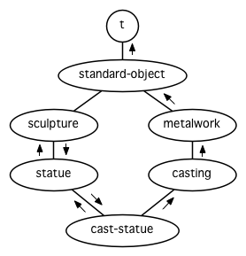

第十一章：Common Lisp 对象系统
==============================

Common Lisp 对象系统，或称
CLOS，是一组用来实现面向对象编程的操作集。由于它们有着同样的历史，通常将这些操作视为一个群组。
[λ](http://acl.readthedocs.org/en/latest/zhCN/notes-cn.html#notes-176)
技术上来说，它们与其他部分的 Common Lisp 没什么大不同： `defmethod` 和
`defun` 一样，都是整合在语言中的一个部分。

11.1 面向对象编程 Object-Oriented Programming
---------------------------------------------

面向对象编程意味着程序组织方式的改变。这个改变跟已经发生过的处理器运算处理能力分配的变化雷同。在
1970
年代，一个多用户的计算机系统代表着，一个或两个大型机连接到大量的[哑终端](http://zh.wikipedia.org/wiki/%E5%93%91%E7%BB%88%E7%AB%AF)(dumb
terminal)。现在更可能的是大量相互通过网络连接的工作站
(workstation)。系统的运算处理能力现在分布至个体用户上，而不是集中在一台大型的计算机上。

面向对象编程所带来的变革与上例非常类似，前者打破了传统程序的组织方式。不再让单一的程序去操作那些数据，而是告诉数据自己该做什么，程序隐含在这些新的数据“对象”的交互过程之中。

举例来说，假设我们要算出一个二维图形的面积。一个办法是写一个单独的函数，让它检查其参数的类型，然后视类型做处理，如图
11.1 所示。

    (defstruct rectangle
      height width)

    (defstruct circle
      radius)

    (defun area (x)
      (cond ((rectangle-p x)
             (* (rectangle-height x) (rectangle-width x)))
            ((circle-p x)
             (* pi (expt (circle-radius x) 2)))))

    > (let ((r (make-rectangle)))
        (setf (rectangle-height r) 2
              (rectangle-width r) 3)
        (area r))
    6

**图 11.1: 使用结构及函数来计算面积**

使用 CLOS 我们可以写出一个等效的程序，如图 11.2
所示。在面向对象模型里，我们的程序被拆成数个独一无二的方法，每个方法为某些特定类型的参数而生。图
11.2 中的两个方法，隐性地定义了一个与图 11.1 相似作用的 `area`
函数，当我们调用 `area` 时，Lisp 检查参数的类型，并调用相对应的方法。

    (defclass rectangle ()
      (height width))

    (defclass circle ()
      (radius))

    (defmethod area ((x rectangle))
      (* (slot-value x 'height) (slot-value x 'width)))

    (defmethod area ((x circle))
      (* pi (expt (slot-value x 'radius) 2)))

    > (let ((r (make-instance 'rectangle)))
        (setf (slot-value r 'height) 2
              (slot-value r 'width) 3)
        (area r))
    6

**图 11.2: 使用类型与方法来计算面积**

通过这种方式，我们将函数拆成独一无二的方法，面向对象暗指*继承*
(*inheritance*) ── 槽（slot）与方法（method）皆有继承。在图 11.2
中，作为第二个参数传给 `defclass`
的空列表列出了所有基类。假设我们要定义一个新类，上色的圆形
(colored-circle)，则上色的圆形有两个基类， `colored` 与 `circle` ：

    (defclass colored ()
      (color))

    (defclass colored-circle (circle colored)
      ())

当我们创造 `colored-circle` 类的实例 (instance)时，我们会看到两个继承：

1.  `colored-circle` 的实例会有两个槽：从 `circle` 类继承而来的 `radius`
    以及从 `colored` 类继承而来的 `color` 。
2.  由于没有特别为 `colored-circle` 定义的 `area` 方法存在，若我们对
    `colored-circle` 实例调用 `area` ，我们会获得替 `circle` 类所定义的
    `area` 方法。

从实践层面来看，面向对象编程代表着以方法、类、实例以及继承来组织程序。为什么你会想这么组织程序？面向对象方法的主张之一说这样使得程序更容易改动。如果我们想要改变
`ob` 类对象所显示的方式，我们只需要改动 `ob` 类的 `display`
方法。如果我们希望创建一个新的类，大致上与 `ob`
相同，只有某些方面不同，我们可以创建一个 `ob`
类的子类。在这个子类里，我们仅改动我们想要的属性，其他所有的属性会从
`ob` 类默认继承得到。要是我们只是想让某个 `ob` 对象和其他的 `ob`
对象不一样，我们可以新建一个 `ob`
对象，直接修改这个对象的属性即可。若是当时的程序写的很讲究，我们甚至不需要看程序中其他的代码一眼，就可以完成种种的改动。
[λ](http://acl.readthedocs.org/en/latest/zhCN/notes-cn.html#notes-178)

11.2 类与实例 (Class and Instances)
-----------------------------------

在 4.6 节时，我们看过了创建结构的两个步骤：我们调用 `defstruct`
来设计一个结构的形式，接着通过一个像是 `make-point`
这样特定的函数来创建结构。创建实例
(instances)同样需要两个类似的步骤。首先我们使用 `defclass`
来定义一个类别 (Class):

    (defclass circle ()
      (radius center))

这个定义说明了 `circle` 类别的实例会有两个槽 (*slot*)，分别名为 `radius`
与 `center` （槽类比于结构里的字段 「field」）。

要创建这个类的实例，我们调用通用的 `make-instance`
函数，而不是调用一个特定的函数，传入的第一个参数为类别名称：

    > (setf c (make-instance 'circle))
    #<CIRCLE #XC27496>

要给这个实例的槽赋值，我们可以使用 `setf` 搭配 `slot-value` ：

    > (setf (slot-value c 'radius) 1)
    1

与结构的字段类似，未初始化的槽的值是未定义的 (undefined)。

11.3 槽的属性 (Slot Properties)
-------------------------------

传给 `defclass`
的第三个参数必须是一个槽定义的列表。如上例所示，最简单的槽定义是一个表示其名称的符号。在一般情况下，一个槽定义可以是一个列表，第一个是槽的名称，伴随着一个或多个属性
(property)。属性像关键字参数那样指定。

通过替一个槽定义一个访问器
(accessor)，我们隐式地定义了一个可以引用到槽的函数，使我们不需要再调用
`slot-value` 函数。如果我们如下更新我们的 `circle` 类定义，

    (defclass circle ()
      ((radius :accessor circle-radius)
       (center :accessor circle-center)))

那我们能够分别通过 `circle-radius` 及 `circle-center` 来引用槽：

    > (setf c (make-instance 'circle))
    #<CIRCLE #XC5C726>

    > (setf (circle-radius c) 1)
    1

    > (circle-radius c)
    1

通过指定一个 `:writer` 或是一个 `:reader` ，而不是 `:accessor`
，我们可以获得访问器的写入或读取行为。

要指定一个槽的缺省值，我们可以给入一个 `:initform` 参数。若我们想要在
`make-instance` 调用期间就将槽初始化，我们可以用 `:initarg`
定义一个参数名。 [^1] 加入刚刚所说的两件事，现在我们的类定义变成：

    (defclass circle ()
      ((radius :accessor circle-radius
               :initarg :radius
               :initform 1)
       (center :accessor circle-center
               :initarg :center
               :initform (cons 0 0))))

现在当我们创建一个 `circle` 类的实例时，我们可以使用关键字参数
`:initarg` 给槽赋值，或是將槽的值设为 `:initform` 所指定的缺省值。

    > (setf c (make-instance 'circle :radius 3))
    #<CIRCLE #XC2DE0E>
    > (circle-radius c)
    3
    > (circle-center c)
    (0 . 0)

注意 `initarg` 的优先级比 `initform` 要高。

我们可以指定某些槽是共享的 ──
也就是每个产生出来的实例，共享槽的值都会是一样的。我们通过声明槽拥有
`:allocation :class` 来办到此事。（另一个办法是让一个槽有
`:allocation :instance`
，但由于这是缺省设置，不需要特别再声明一次。）当我们在一个实例中，改变了共享槽的值，则其它实例共享槽也会获得相同的值。所以我们会想要使用共享槽来保存所有实例都有的相同属性。

举例来说，假设我们想要模拟一群成人小报 (a flock of
tabloids)的行为。（**译注**：可以看看[什么是
tabloids](http://tinyurl.com/9n4dckk)。）在我们的模拟中，我们想要能够表示一个事实，也就是当一家小报采用一个头条时，其它小报也会跟进的这个行为。我们可以通过让所有的实例共享一个槽来实现。若
`tabloid` 类别像下面这样定义，

    (defclass tabloid ()
      ((top-story :accessor tabloid-story
                  :allocation :class)))

那么如果我们创立两家小报，无论一家的头条是什么，另一家的头条也会是一样的：

    > (setf daily-blab (make-instance 'tabloid)
            unsolicited-mail (make-instance 'tabloid))
    #<TABLOID #x302000EFE5BD>
    > (setf (tabloid-story daily-blab) 'adultery-of-senator)
    ADULTERY-OF-SENATOR
    > (tabloid-story unsolicited-mail)
    ADULTERY-OF-SENATOR

**译注**： ADULTERY-OF-SENATOR 参议员的性丑闻。

若有给入 `:documentation` 属性的话，用来作为 `slot`
的文档字符串。通过指定一个 `:type`
，你保证一个槽里只会有这种类型的元素。类型声明会在 13.3 节讲解。

11.4 基类 (Superclasses)
------------------------

`defclass`
接受的第二个参数是一个列出其基类的列表。一个类别继承了所有基类槽的联集。所以要是我们将
`screen-circle` 定义成 `circle` 与 `graphic` 的子类，

    (defclass graphic ()
      ((color :accessor graphic-color :initarg :color)
       (visible :accessor graphic-visible :initarg :visible
                :initform t)))

    (defclass screen-circle (circle graphic) ())

则 `screen-circle`
的实例会有四个槽，分别从两个基类继承而来。一个类别不需要自己创建任何新槽；
`screen-circle` 的存在，只是为了提供一个可创建同时从 `circle` 及
`graphic` 继承的实例。

访问器及 `:initargs` 参数可以用在 `screen-circle`
的实例，就如同它们也可以用在 `circle` 或 `graphic` 类别那般：

    > (graphic-color (make-instance 'screen-circle
                                    :color 'red :radius 3))
    RED

我们可以使每一个 `screen-circle` 有某种缺省的颜色，通过在 `defclass`
里替这个槽指定一个 `:initform` ：

    (defclass screen-circle (circle graphic)
      ((color :initform 'purple)))

现在 `screen-circle` 的实例缺省会是紫色的：

    > (graphic-color (make-instance 'screen-circle))
    PURPLE

11.5 优先级 (Precedence)
------------------------

我们已经看过类别是怎样能有多个基类了。当一个实例的方法同时属于这个实例所属的几个类时，Lisp
需要某种方式来决定要使用哪个方法。优先级的重点在于确保这一切是以一种直观的方式发生的。

每一个类别，都有一个优先级列表：一个将自身及自身的基类从最具体到最不具体所排序的列表。在目前看过的例子中，优先级还不是需要讨论的议题，但在更大的程序里，它会是一个需要考虑的议题。

以下是一个更复杂的类别层级：

    (defclass sculpture () (height width depth))

    (defclass statue (sclpture) (subject))

    (defclass metalwork () (metal-type))

    (defclass casting (metalwork) ())

    (defclass cast-statue (statue casting) ())

图 11.3 包含了一个表示 `cast-statue` 类别及其基类的网络。

**图 11.3: 类别层级**

要替一个类别建构一个这样的网络，从最底层用一个节点表示该类别开始。接着替类别最近的基类画上节点，其顺序根据
`defclass`
调用里的顺序由左至右画，再来给每个节点重复这个过程，直到你抵达一个类别，这个类别最近的基类是
`standard-object` ── 即传给 `defclass` 的第二个参数为 `()`
的类别。最后从这些类别往上建立链接，到表示 `standard-object`
节点为止，接着往上加一个表示类别 `t`
的节点与一个链接。结果会是一个网络，最顶与最下层各为一个点，如图 11.3
所示。

一个类别的优先级列表可以通过如下步骤，遍历对应的网络计算出来：

1.  从网络的底部开始。
2.  往上走，遇到未探索的分支永远选最左边。
3.  如果你将进入一个节点，你发现此节点右边也有一条路同样进入该节点时，则从该节点退后，重走刚刚的老路，直到回到一个节点，这个节点上有尚未探索的路径。接着返回步骤
    2。
4.  当你抵达表示 `t`
    的节点时，遍历就结束了。你第一次进入每个节点的顺序就决定了节点在优先级列表的顺序。

这个定义的结果之一（实际上讲的是规则
3）在优先级列表里，类别不会在其子类别出现前出现。

图 11.3
的箭头演示了一个网络是如何遍历的。由这个图所决定出的优先级列表为：
`cast-statue` , `statue` , `sculpture` , `casting` , `metalwork` ,
`standard-object` , `t` 。有时候会用 *specific*
这个词，作为在一个给定的优先级列表中来引用类别的位置的速记法。优先级列表从最高优先级排序至最低优先级。

优先级的主要目的是，当一个通用函数 (generic
function)被调用时，决定要用哪个方法。这个过程在下一节讲述。另一个优先级重要的地方是，当一个槽从多个基类继承时。408
页的备注解释了当这情况发生时的应用规则。
[λ](http://acl.readthedocs.org/en/latest/zhCN/notes-cn.html#notes-183)

11.6 通用函数 (Generic Functions)
---------------------------------

一个通用函数 (generic function)
是由一个或多个方法组成的一个函数。方法可用 `defmethod` 来定义，与
`defun` 的定义形式类似：

    (defmethod combine (x y)
      (list x y))

现在 `combine` 有一个方法。若我们在此时调用 `combine`
，我们会获得由传入的两个参数所组成的一个列表：

    > (combine 'a 'b)
    (A B)

到现在我们还没有做任何一般函数做不到的事情。一个通用函数不寻常的地方是，我们可以继续替它加入新的方法。

首先，我们定义一些可以让新的方法引用的类别：

    (defclass stuff () ((name :accessor name :initarg :name)))
    (defclass ice-cream (stuff) ())
    (defclass topping (stuff) ())

这里定义了三个类别： `stuff` ，只是一个有名字的东西，而 `ice-cream` 与
`topping` 是 `stuff` 的子类。

现在下面是替 `combine` 定义的第二个方法：

    (defmethod combine ((ic ice-cream) (top topping))
      (format nil "~A ice-cream with ~A topping."
              (name ic)
              (name top)))

在这次 `defmethod` 的调用中，参数被特化了
(*specialized*)：每个出现在列表里的参数都有一个类别的名字。一个方法的特化指出它是应用至何种类别的参数。我们刚定义的方法仅能在传给
`combine` 的参数分别是 `ice-cream` 与 `topping` 的实例时。

而当一个通用函数被调用时， Lisp 是怎么决定要用哪个方法的？Lisp
会使用参数的类别与参数的特化匹配且优先级最高的方法。这表示若我们用
`ice-cream` 实例与 `topping` 实例去调用 `combine`
方法，我们会得到我们刚刚定义的方法：

    > (combine (make-instance 'ice-cream :name 'fig)
               (make-instance 'topping :name 'treacle))
    "FIG ice-cream with TREACLE topping"

但使用其他参数时，我们会得到我们第一次定义的方法：

    > (combine 23 'skiddoo)
    (23 SKIDDOO)

因为第一个方法的两个参数皆没有特化，它永远只有最低优先权，并永远是最后一个调用的方法。一个未特化的方法是一个安全手段，就像
`case` 表达式中的 `otherwise` 子句。

一个方法中，任何参数的组合都可以特化。在这个方法里，只有第一个参数被特化了：

    (defmethod combine ((ic ice-cream) x)
      (format nil "~A ice-cream with ~A."
              (name ic)
              x))

若我们用一个 `ice-cream` 的实例以及一个 `topping` 的实例来调用 `combine`
，我们仍然得到特化两个参数的方法，因为它是最具体的那个：

    > (combine (make-instance 'ice-cream :name 'grape)
               (make-instance 'topping :name 'marshmallow))
    "GRAPE ice-cream with MARSHMALLOW topping"

然而若第一个参数是 `ice-cream` 而第二个参数不是 `topping`
的实例的话，我们会得到刚刚上面所定义的那个方法：

    > (combine (make-instance 'ice-cream :name 'clam)
               'reluctance)
    "CLAM ice-cream with RELUCTANCE"

当一个通用函数被调用时，参数决定了一个或多个可用的方法 (*applicable*
methods)。如果在调用中的参数在参数的特化约定内，我们说一个方法是可用的。

如果没有可用的方法，我们会得到一个错误。如果只有一个，它会被调用。如果多于一个，最具体的会被调用。最具体可用的方法是由调用传入参数所属类别的优先级所决定的。由左往右审视参数。如果有一个可用方法的第一个参数，此参数特化给某个类，其类的优先级高于其它可用方法的第一个参数，则此方法就是最具体的可用方法。平手时比较第二个参数，以此类推。
[^2]

在前面的例子里，很容易看出哪个是最具体的可用方法，因为所有的对象都是单继承的。一个
`ice-cream` 的实例是，按顺序来， `ice-cream` ， `stuff` ，
`standard-object` ， 以及 `t` 类别的成员。

方法不需要在由 `defclass`
定义的类别层级来做特化。他们也可以替类型做特化（更精准的说，可以反映出类型的类别）。以下是一个给
`combine` 用的方法，对数字做了特化：

    (defmethod combine ((x number) (y number))
      (+ x y))

方法甚至可以对单一的对象做特化，用 `eql` 来决定：

    (defmethod combine ((x (eql 'powder)) (y (eql 'spark)))
      'boom)

单一对象特化的优先级比类别特化来得高。

方法可以像一般 Common Lisp
函数一样有复杂的参数列表，但所有组成通用函数方法的参数列表必须是一致的
(*congruent*)。参数的数量必须一致，同样数量的选择性参数（如果有的话），要嘛一起使用
`&rest` 或是 `&key` 参数，或者一起不要用。下面的参数列表对是全部一致的，

    (x)             (a)
    (x &optional y) (a &optional b)
    (x y &rest z)   (a b &key c)
    (x y &key z)    (a b &key c d)

而下列的参数列表对不是一致的：

    (x)             (a b)
    (x &optional y) (a &optional b c)
    (x &optional y) (a &rest b)
    (x &key x y)    (a)

只有必要参数可以被特化。所以每个方法都可以通过名字及必要参数的特化独一无二地识别出来。如果我们定义另一个方法，有着同样的修饰符及特化，它会覆写掉原先的。所以通过说明

    (defmethod combine ((x (eql 'powder)) (y (eql 'spark)))
      'kaboom)

我们重定义了当 `combine` 方法的参数是 `powder` 与 `spark` 时， `combine`
方法干了什么事儿。

11.7 辅助方法 (Auxiliary Methods)
---------------------------------

方法可以通过如 `:before` ， `:after` 以及 `:around` 等辅助方法来增强。
`:before` 方法允许我们说：“嘿首先，先做这个。” 最具体的 `:before`
方法**优先**被调用，作为其它方法调用的序幕 (prelude)。 `:after`
方法允许我们说 “P.S. 也做这个。” 最具体的 `:after`
方法**最后**被调用，作为其它方法调用的闭幕
(epilogue)。在这之间，我们运行的是在这之前仅视为方法的方法，而准确地说应该叫做主方法
(*primary method*)。这个主方法调用所返回的值为方法的返回值，甚至
`:after` 方法在之后被调用也不例外。

`:before` 与 `:after` 方法允许我们将新的行为包在调用主方法的周围。
`:around` 方法提供了一个更戏剧的方式来办到这件事。如果 `:around`
方法存在的话，会调用的是 `:around`
方法而不是主方法。则根据它自己的判断， `:around`
方法自己可能会调用主方法（通过函数 `call-next-method`
，这也是这个函数存在的目的）。

这称为标准方法组合机制 (*standard method
combination*)。在标准方法组合机制里，调用一个通用函数会调用

1.  最具体的 `:around` 方法，如果有的话。
2.  否则，依序，

    > (a) 所有的 `:before` 方法，从最具体到最不具体。
    > (b) 最具体的主方法
    > (c) 所有的 `:after` 方法，从最不具体到最具体

返回值为 `:around` 方法的返回值（情况
1）或是最具体的主方法的返回值（情况 2）。

辅助方法通过在 `defmethod` 调用中，在方法名后加上一个修饰关键字
(qualifying keyword)来定义。如果我们替 `speaker` 类别定义一个主要的
`speak` 方法如下：

    (defclass speaker () ())

    (defmethod speak ((s speaker) string)
        (format t "~A" string))

则使用 `speaker` 实例来调用 `speak` 仅印出第二个参数：

    > (speak (make-instance 'speaker)
             "I'm hungry")
    I'm hungry
    NIL

通过定义一个 `intellectual` 子类，将主要的 `speak` 方法用 `:before` 与
`:after` 方法包起来，

    (defclass intellectual (speaker) ())

    (defmethod speak :before ((i intellectual) string)
      (princ "Perhaps "))

    (defmethod speak :after ((i intellectual) string)
      (princ " in some sense"))

我们可以创建一个说话前后带有惯用语的演讲者：

    > (speak (make-instance 'intellectual)
             "I am hungry")
    Perhaps I am hungry in some sense
    NIL

如同先前标准方法组合机制所述，所有的 `:before` 及 `:after`
方法都被调用了。所以如果我们替 `speaker` 基类定义 `:before` 或 `:after`
方法，

    (defmethod speak :before ((s speaker) string)
      (princ "I think "))

无论是哪个 `:before` 或 `:after`
方法被调用，整个通用函数所返回的值，是最具体主方法的返回值 ──
在这个情况下，为 `format` 函数所返回的 `nil` 。

而在有 `:around`
方法时，情况就不一样了。如果有一个替传入通用函数特别定义的 `:around`
方法，则优先调用 `:around` 方法，而其它的方法要看 `:around`
方法让不让它们被运行。一个 `:around` 或主方法，可以通过调用
`call-next-method` 来调用下一个方法。在调用下一个方法前，它使用
`next-method-p` 来检查是否有下个方法可调用。

有了 `:around` 方法，我们可以定义另一个，更谨慎的， `speaker` 的子类别：

    (defclass courtier (speaker) ())

    (defmethod speak :around ((c courtier) string)
      (format t "Does the King believe that ~A?" string)
      (if (eql (read) 'yes)
          (if (next-method-p) (call-next-method))
          (format t "Indeed, it is a preposterous idea. ~%"))
      'bow)

当传给 `speak` 的第一个参数是 `courtier` 类的实例时，朝臣
(courtier)的舌头有了 `:around` 方法保护，就不会被割掉了：

    > (speak (make-instance 'courtier) "kings will last")
    Does the King believe that kings will last? yes
    I think kings will last
    BOW
    > (speak (make-instance 'courtier) "kings will last")
    Does the King believe that kings will last? no
    Indeed, it is a preposterous idea.
    BOW

记得由 `:around` 方法所返回的值即通用函数的返回值，这与 `:before` 与
`:after` 方法的返回值不一样。

11.8 方法组合机制 (Method Combination)
--------------------------------------

在标准方法组合中，只有最具体的主方法会被调用（虽然它可以通过
`call-next-method`
来调用其它方法）。但我们可能会想要把所有可用的主方法的结果汇总起来。

用其它组合手段来定义方法也是有可能的 ──
举例来说，一个返回所有可用主方法的和的通用函数。*操作符*
(*Operator*)方法组合可以这么理解，想像它是 Lisp
表达式的求值后的结果，其中 Lisp
表达式的第一个元素是某个操作符，而参数是按照具体性调用可用主方法的结果。如果我们定义
`price` 使用 `+` 来组合数值的通用函数，并且没有可用的 `:around`
方法，它会如它所定义的方式动作：

    (defun price (&rest args)
      (+ (apply 〈most specific primary method〉 args)
         .
         .
         .
         (apply 〈least specific primary method〉 args)))

如果有可用的 `:around`
方法的话，它们根据优先级决定，就像是标准方法组合那样。在操作符方法组合里，一个
`around` 方法仍可以通过 `call-next-method`
调用下个方法。然而主方法就不可以使用 `call-next-method` 了。

我们可以指定一个通用函数的方法组合所要使用的类型，借由在 `defgeneric`
调用里加入一个 `method-combination` 子句：

    (defgeneric price (x)
      (:method-combination +))

现在 `price` 方法会使用 `+` 方法组合；任何替 `price` 定义的 `defmethod`
必须有 `+` 来作为第二个参数。如果我们使用 `price` 来定义某些类型，

    (defclass jacket () ())
    (defclass trousers () ())
    (defclass suit (jacket trousers) ())

    (defmethod price + ((jk jacket)) 350)
    (defmethod price + ((tr trousers)) 200)

则可获得一件正装的价钱，也就是所有可用方法的总和：

    > (price (make-instance 'suit))
    550

下列符号可以用来作为 `defmethod` 的第二个参数或是作为 `defgeneric`
调用中，`method-combination` 的选项：

    +    and    append    list    max    min    nconc    or    progn

你也可以使用 `standard` ，yields 标准方法组合。

一旦你指定了通用函数要用何种方法组合，所有替该函数定义的方法必须用同样的机制。而现在如果我们试着使用另个操作符（
`:before` 或 `after` ）作为 `defmethod` 给 `price`
的第二个参数，则会抛出一个错误。如果我们想要改变 `price`
的方法组合机制，我们需要通过调用 `fmakunbound` 来移除整个通用函数。

11.9 封装 (Encapsulation)
-------------------------

面向对象的语言通常会提供某些手段，来区别对象的表示法以及它们给外在世界存取的介面。隐藏实现细节带来两个优点：你可以改变实现方式，而不影响对象对外的样子，而你可以保护对象在可能的危险方面被改动。隐藏细节有时候被称为封装
(*encapsulated*)。

虽然封装通常与面向对象编程相关联，但这两个概念其实是没相干的。你可以只拥有其一，而不需要另一个。我们已经在
108 页 (**译注：** 6.5 小节。)看过一个小规模的封装例子。函数 `stamp` 及
`reset`
通过共享一个计数器工作，但调用时我们不需要知道这个计数器，也保护我们不可直接修改它。

在 Common Lisp
里，包是标准的手段来区分公开及私有的信息。要限制某个东西的存取，我们将它放在另一个包里，并且针对外部介面，仅输出需要用的名字。

我们可以通过输出可被改动的名字，来封装一个槽，但不是槽的名字。举例来说，我们可以定义一个
`counter` 类别，以及相关的 `increment` 及 `clear` 方法如下：

    (defpackage "CTR"
      (:use "COMMON-LISP")
      (:export "COUNTER" "INCREMENT" "CLEAR"))

    (in-package ctr)

    (defclass counter () ((state :initform 0)))

    (defmethod increment ((c counter))
      (incf (slot-value c 'state)))

    (defmethod clear ((c counter))
      (setf (slot-value c 'state) 0))

在这个定义下，在包外部的代码只能够创造 `counter` 的实例，并调用
`increment` 及 `clear` 方法，但不能够存取 `state` 。

如果你想要更进一步区别类的内部及外部介面，并使其不可能存取一个槽所存的值，你也可以这么做。只要在你将所有需要引用它的代码定义完，将槽的名字
unintern：

    (unintern 'state)

则没有任何合法的、其它的办法，从任何包来引用到这个槽。
[λ](http://acl.readthedocs.org/en/latest/zhCN/notes-cn.html#notes-191)

11.10 两种模型 (Two Models)
---------------------------

面向对象编程是一个令人疑惑的话题，部分的原因是因为有两种实现方式：消息传递模型
(message-passing model)与通用函数模型 (generic function
model)。一开始先有的消息传递。通用函数是广义的消息传递。

在消息传递模型里，方法属于对象，且方法的继承与槽的继承概念一样。要找到一个物体的面积，我们传给它一个
`area` 消息：

    tell obj area

而这调用了任何对象 `obj` 所拥有或继承来的 area 方法。

有时候我们需要传入额外的参数。举例来说，一个 `move`
方法接受一个说明要移动多远的参数。如我我们想要告诉 `obj` 移动 10
个单位，我们可以传下面的消息：

    (move obj 10)

消息传递模型的局限性变得清晰。在消息传递模型里，我们仅特化 (specialize)
第一个参数。 牵扯到多对象时，没有规则告诉方法该如何处理 ──
而对象回应消息的这个模型使得这更加难处理了。

在消息传递模型里，方法是对象所有的，而在通用函数模型里，方法是特别为对象打造的
(specialized)。
如果我们仅特化第一个参数，那么通用函数模型和消息传递模型就是一样的。但在通用函数模型里，我们可以更进一步，要特化几个参数就几个。这也表示了，功能上来说，消息传递模型是通用函数模型的子集。如果你有通用函数模型，你可以仅特化第一个参数来模拟出消息传递模型。

Chapter 11 总结 (Summary)
-------------------------

1.  在面向对象编程中，函数 `f` 通过定义拥有 `f`
    方法的对象来隐式地定义。对象从它们的父母继承方法。
2.  定义一个类别就像是定义一个结构，但更加啰嗦。一个共享的槽属于一整个类别。
3.  一个类别从基类中继承槽。
4.  一个类别的祖先被排序成一个优先级列表。理解优先级算法最好的方式就是通过视觉。
5.  一个通用函数由一个给定名称的所有方法所组成。一个方法通过名称及特化参数来识别。参数的优先级决定了当调用一个通用函数时会使用哪个方法。
6.  方法可以通过辅助方法来增强。标准方法组合机制意味着如果有 `:around`
    方法的话就调用它；否则依序调用 `:before` ，最具体的主方法以及
    `:after` 方法。
7.  在操作符方法组合机制中，所有的主方法都被视为某个操作符的参数。
8.  封装可以通过包来实现。
9.  面向对象编程有两个模型。通用函数模型是广义的消息传递模型。

Chapter 11 练习 (Exercises)
---------------------------

1.  替图 11.2 所定义的类定义访问器、 initforms 以及 initargs
    。重写相关的代码使其再也不用调用 `slot-value` 。
2.  重写图 9.5 的代码，使得球体与点为类别，而 `intersect` 及 `normal`
    为通用函数。
3.  假设有若干类别定义如下：

<!-- -->

    (defclass a (c d)   ...)  (defclass e ()  ...)
    (defclass b (d c)   ...)  (defclass f (h) ...)
    (defclass c ()      ...)  (defclass g (h) ...)
    (defclass d (e f g) ...)  (defclass h ()  ...)

(a) 画出表示类别 `a` 祖先的网络以及列出 `a`
    的实例归属的类别，从最相关至最不相关排列。
(b) 替类别 `b` 也做 (a) 小题的要求。

4.  假定你已经有了下列函数：

`precedence`
：接受一个对象并返回其优先级列表，列表由最具体至最不具体的类组成。

`methods` ：接受一个通用函数并返回一个列出所有方法的列表。

`specializations`
：接受一个方法并返回一个列出所有特化参数的列表。返回列表中的每个元素是类别或是这种形式的列表
`(eql x)` ，或是 `t` （表示该参数没有被特化）。

使用这些函数（不要使用 `compute-applicable-methods` 及 `find-method`
），定义一个函数 `most-spec-app-meth`
，该函数接受一个通用函数及一个列出此函数被调用过的参数，如果有最相关可用的方法的话，返回它。

5.  不要改变通用函数 `area` 的行为（图 11.2），
6.  举一个只有通用函数的第一个参数被特化会很难解决的问题的例子。

**脚注**

[^1]: Initarg 的名称通常是关键字，但不需要是。

[^2]: 我们不可能比较完所有的参数而仍有平手情形存在，因为这样我们会有两个有着同样特化的方法。这是不可能的，因为第二个的定义会覆写掉第一个。
