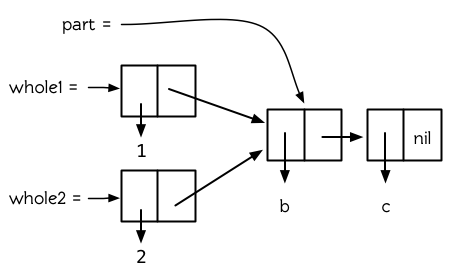

第十二章：结构
==============

3.3 节中介绍了 Lisp
如何使用指针允许我们将任何值放到任何地方。这种说法是完全有可能的，但这并不一定都是好事。

例如，一个对象可以是它自已的一个元素。这是好事还是坏事，取决于程序员是不是有意这样设计的。

12.1 共享结构 (Shared Structure)
--------------------------------

多个列表可以共享 `cons`
。在最简单的情况下，一个列表可以是另一个列表的一部分。

    > (setf part (list 'b 'c))
    (B C)
    > (setf whole (cons 'a part))
    (A B C)

**图 12.1 共享结构**

执行上述操作后，第一个 `cons` 是第二个 `cons` 的一部分 (事实上，是第二个
`cons` 的 `cdr` )。在这样的情况下，我们说，这两个列表是共享结构 (Share
Structure)。这两个列表的基本结构如图 12.1 所示。

其中，第一个 `cons` 是第二个 `cons` 的一部分 (事实上，是第二个 `cons` 的
`cdr` )。在这样的情况下，我们称这两个列表为共享结构 (Share
Structure)。这两个列表的基本结构如图 12.1 所示。

使用 `tailp`
判断式来检测一下。将两个列表作为它的输入参数，如果第一个列表是第二个列表的一部分时，则返回
`T` ：

    > (tailp part whole)
    T

我们可以把它想像成：

    (defun our-tailp (x y)
      (or (eql x y)
          (and (consp y)
                     (our-tailp x (cdr y)))))

如定义所表明的，每个列表都是它自己的尾端， `nil`
是每一个正规列表的尾端。

在更复杂的情况下，两个列表可以是共享结构，但彼此都不是对方的尾端。在这种情况下，他们都有一个共同的尾端，如图
12.2 所示。我们像这样构建这种情况：

    (setf part (list 'b 'c)
                whole1 (cons 1 part)
                whole2 (cons 2 part))

**图 12.2 被共享的尾端**

现在 `whole1` 和 `whole2` 共享结构，但是它们彼此都不是对方的一部分。

当存在嵌套列表时，重要的是要区分是列表共享了结构，还是列表的元素共享了结构。顶层列表结构指的是，直接构成列表的那些
`cons` ，而不包含那些用于构造列表元素的 `cons` 。图 12.3
是一个嵌套列表的顶层列表结构 (**译者注：**图 12.3
中上面那三个有黑色阴影的 `cons` 即构成顶层列表结构的 `cons` )。

**图 12.3 顶层列表结构**

两个 `cons`
是否共享结构，取决于我们把它们看作是列表还是[树](http://zh.wikipedia.org/wiki/%E6%A0%91_(%E6%95%B0%E6%8D%AE%E7%BB%93%E6%9E%84))。可能存在两个嵌套列表，当把它们看作树时，它们共享结构，而看作列表时，它们不共享结构。图
12.4
构建了这种情况，两个列表以一个元素的形式包含了同一个列表，代码如下：

    (setf element (list 'a 'b)
          holds1 (list 1 element 2)
          holds2 (list element 3))

**图 12.4 共享子树**

虽然 `holds1` 的第二个元素和 `holds2` 的第一个元素共享结构
(其实是相同的)，但如果把 `holds1` 和 `holds2`
看成是列表时，它们不共享结构。仅当两个列表共享顶层列表结构时，才能说这两个列表共享结构，而
`holds1` 和 `holds2` 没有共享顶层列表结构。

如果我们想避免共享结构，可以使用复制。函数 `copy-list` 可以这样定义：

    (defun our-copy-list (lst)
       (if (null lst)
           nil
           (cons (car lst) (our-copy-list (cdr lst)))))

它返回一个不与原始列表共享顶层列表结构的新列表。函数 `copy-tree`
可以这样定义：

    (defun our-copy-tree (tr)
       (if (atom tr)
            tr
            (cons (our-copy-tree (car tr))
                  (our-copy-tree (cdr tr)))))

它返回一个连原始列表的树型结构也不共享的新列表。图 12.5
显示了对一个嵌套列表使用 `copy-list` 和 `copy-tree` 的区别。

**图 12.5 两种复制**

12.2 修改 (Modification)
------------------------

为什么要避免共享结构呢？之前讨论的共享结构问题仅仅是个智力练习，到目前为止，并没使我们在实际写程序的时候有什么不同。当修改一个被共享的结构时，问题出现了。如果两个列表共享结构，当我们修改了其中一个，另外一个也会无意中被修改。

上一节中，我们介绍了怎样构建一个是其它列表的尾端的列表：

    (setf whole (list 'a 'b 'c)
          tail (cdr whole))

因为 `whole` 的 `cdr` 与 `tail` 是相等的，无论是修改 `tail` 还是 `whole`
的 `cdr` ，我们修改的都是同一个 `cons` ：

    > (setf (second tail ) 'e)
    E
    > tail
    (B E)
    > whole
    (A B E)

同样的，如果两个列表共享同一个尾端，这种情况也会发生。

一次修改两个对象并不总是错误的。有时候这可能正是你想要的。但如果无意的修改了共享结构，将会引入一些非常微妙的
bug。Lisp
程序员要培养对共享结构的意识，并且在这类错误发生时能够立刻反应过来。当一个列表神秘的改变了的时候，很有可能是因为改变了其它与之共享结构的对象。

真正危险的不是共享结构，而是改变被共享的结构。为了安全起见，干脆避免对结构使用
`setf` (以及相关的运算，比如： `pop` ， `rplaca`
等)，这样就不会遇到问题了。如果某些时候不得不修改列表结构时，要搞清楚要修改的列表的来源，确保它不要和其它不需要改变的对象共享结构。如果它和其它不需要改变的对象共享了结构，或者不能预测它的来源，那么复制一个副本来进行改变。

当你调用别人写的函数的时候要加倍小心。除非你知道它内部的操作，否则，你传入的参数时要考虑到以下的情况：

1.它对你传入的参数可能会有破坏性的操作

2.你传入的参数可能被保存起来，如果你调用了一个函数，然后又修改了之前作为参数传入该函数的对象，那么你也就改变了函数已保存起来作为它用的对象[1]。

在这两种情况下，解决的方法是传入一个拷贝。

在 Common Lisp 中，一个函数调用在遍历列表结构 (比如， `mapcar` 或
`remove-if`
的参数)的过程中不允许修改被遍历的结构。关于评估这样的代码的重要性并没有明确的规定。

12.3 示例：队列 (Example: Queues)
---------------------------------

共享结构并不是一个总让人担心的特性。我们也可以对其加以利用的。这一节展示了怎样用共享结构来表示[队列](http://zh.wikipedia.org/wiki/%E9%98%9F%E5%88%97)。队列对象是我们可以按照数据的插入顺序逐个检出数据的仓库，这个规则叫做[先进先出
(FIFO, first in, first
out)](http://zh.wikipedia.org/zh-cn/%E5%85%88%E9%80%B2%E5%85%88%E5%87%BA)。

用列表表示[栈
(stack)](http://zh.wikipedia.org/wiki/%E6%A0%88)比较容易，因为栈是从同一端插入和检出。而表示队列要困难些，因为队列的插入和检出是在不同端。为了有效的实现队列，我们需要找到一种办法来指向列表的两个端。

图 12.6 给出了一种可行的策略。它展示怎样表示一个含有 a，b，c
三个元素的队列。一个队列就是一对列表，最后那个 `cons`
在相同的列表中。这个列表对由被称作头端 (front)和尾端
(back)的两部分组成。如果要从队列中检出一个元素，只需在其头端
`pop`，要插入一个元素，则创建一个新的 `cons` ，把尾端的 `cdr`
设置成指向这个 `cons` ，然后将尾端指向这个新的 `cons` 。

**图 12.6 一个队列的结构**

    (defun make-queue () (cons nil nil))

    (defun enqueue (obj q)
      (if (null (car q))
          (setf (cdr q) (setf (car q) (list obj)))
          (setf (cdr (cdr q)) (list obj)
                (cdr q) (cdr (cdr q))))
      (car q))

    (defun dequeue (q)
      (pop (car q)))

**图 12.7 队列实现**

图 12.7 中的代码实现了这一策略。其用法如下：

    > (setf q1 (make-queue))
    (NIL)
    > (progn (enqueue 'a q1)
         (enqueue 'b q1)
         (enqueue 'c q1))
    (A B C)

现在， `q1` 的结构就如图 12.6 那样：

    > q1
    ((A B C) C)

从队列中检出一些元素：

    > (dequeue q1)
    A
    > (dequeue q1)
    B
    > (enqueue 'd q1)
    (C D)

12.4 破坏性函数 (Destructive Functions)
---------------------------------------

Common Lisp
包含一些允许修改列表结构的函数。为了提高效率，这些函数是具有破坏性的。虽然它们可以回收利用作为参数传给它们的
`cons` ，但并不是因为想要它们的副作用而调用它们
(**译者注：**因为这些函数的副作用并没有任何保证，下面的例子将说明问题)。

比如， `delete` 是 `remove`
的一个具有破坏性的版本。虽然它可以破坏作为参数传给它的列表，但它并不保证什么。在大多数的
Common Lisp 的实现中，会出现下面的情况：

    > (setf lst '(a r a b i a) )
    (A R A B I A)
    > (delete 'a lst )
    (R B I)
    > lst
    (A R B I)

正如 `remove` 一样，如果你想要副作用，应该对返回值使用 `setf` ：

    (setf lst (delete 'a lst))

破坏性函数是怎样回收利用传给它们的列表的呢？比如，可以考虑 `nconc` ——
`append`
的破坏性版本。[2]下面是两个参数版本的实现，其清楚地展示了两个已知列表是怎样被缝在一起的：

    (defun nconc2 ( x y)
        (if (consp x)
        (progn
           (setf (cdr (last x)) y)
            x)
         y))

我们找到第一个列表的最后一个 *Cons* 核 (cons cells)，把它的 `cdr`
设置成指向第二个列表。一个正规的多参数的 `nconc` 可以被定义成像附录 B
中的那样。

函数 `mapcan` 类似 `mapcar` ，但它是用 `nconc` 把函数的返回值
(必须是列表) 拼接在一起的：

    > (mapcan #'list
          '(a b c)
          '(1 2 3 4))
    ( A 1 B 2 C 3)

这个函数可以定义如下：

    (defun our-mapcan (fn &rest lsts )
           (apply #'nconc (apply #'mapcar fn lsts)))

使用 `mapcan` 时要谨慎，因为它具有破坏性。它用 `nconc`
拼接返回的列表，所以这些列表最好不要再在其它地方使用。

这类函数在处理某些问题的时候特别有用，比如，收集树在某层上的所有子结点。如果
`children`
函数返回一个节点的孩子节点的列表，那么我们可以定义一个函数返回某节点的孙子节点的列表如下：

    (defun grandchildren (x)
       (mapcan #'(lambda (c)
            (copy-list (children c)))
           (children x)))

这个函数调用 `copy-list` 时存在一个假设 —— `chlidren`
函数返回的是一个已经保存在某个地方的列表，而不是构建了一个新的列表。

一个 `mapcan` 的无损变体可以这样定义：

    (defun mappend (fn &rest lsts )
        (apply #'append (apply #'mapcar fn lsts)))

如果使用 `mappend` 函数，那么 `grandchildren` 的定义就可以省去
`copy-list` ：

    (defun grandchildren (x)
       (mappend #'children (children x)))

12.5 示例：二叉搜索树 (Example: Binary Search Trees)
----------------------------------------------------

在某些情况下，使用破坏性操作比使用非破坏性的显得更自然。第 4.7
节中展示了如何维护一个具有二分搜索格式的有序对象集
(或者说维护一个[二叉搜索树
(BST)](http://zh.wikipedia.org/zh-cn/%E4%BA%8C%E5%85%83%E6%90%9C%E5%B0%8B%E6%A8%B9))。第
4.7
节中给出的函数都是非破坏性的，但在我们真正使用BST的时候，这是一个不必要的保护措施。本节将展示如何定义更符合实际应用的具有破坏性的插入函数和删除函数。

图 12.8 展示了如何定义一个具有破坏性的 `bst-insert` (第 72
页「**译者注：**第 4.7
节」)。相同的输入参数，能够得到相同返回值。唯一的区别是，它将修改作为第二个参数输入的
BST。 在第 2.12
节中说过，具有破坏性并不意味着一个函数调用具有副作用。的确如此，如果你想使用
`bst-insert!` 构造一个 BST，你必须像调用 `bst-insert` 那样调用它：

    > (setf *bst* nil)
    NIL
    > (dolist (x '(7 2 9 8 4 1 5 12))
    (setf *bst* (bst-insert! x *bst* #'<)))
    NIL

    (defun bst-insert! (obj bst <)
      (if (null bst)
          (make-node :elt obj)
          (progn (bsti obj bst <)
                 bst)))

    (defun bsti (obj bst <)
      (let ((elt (node-elt bst)))
        (if (eql obj elt)
            bst
            (if (funcall < obj elt)
                (let ((l (node-l bst)))
                  (if l
                      (bsti obj l <)
                      (setf (node-l bst)
                            (make-node :elt obj))))
                (let ((r (node-r bst)))
                  (if r
                      (bsti obj r <)
                      (setf (node-r bst)
                            (make-node :elt obj))))))))

**图 12.8: 二叉搜索树：破坏性插入**

你也可以为 BST 定义一个类似 push
的功能，但这超出了本书的范围。(好奇的话，可以参考第 409 页
「**译者注：**即备注 204 」 的宏定义。)

与 `bst-remove` (第 74 页「**译者注：**第 4.7 节」) 对应，图 12.9
展示了一个破坏性版本的 `bst-delete` 。同 `delete`
一样，我们调用它并不是因为它的副作用。你应该像调用 `bst-remove` 那样调用
`bst-delete` ：

    > (setf *bst* (bst-delete 2 *bst* #'<) )
    #<7>
    > (bst-find 2 *bst* #'<)
    NIL

    (defun bst-delete (obj bst <)
      (if bst (bstd obj bst nil nil <))
      bst)

    (defun bstd (obj bst prev dir <)
      (let ((elt (node-elt bst)))
        (if (eql elt obj)
            (let ((rest (percolate! bst)))
              (case dir
                (:l (setf (node-l prev) rest))
                (:r (setf (node-r prev) rest))))
          (if (funcall < obj elt)
              (if (node-l bst)
                  (bstd obj (node-l bst) bst :l <))
              (if (node-r bst)
                  (bstd obj (node-r bst) bst :r <))))))

    (defun percolate! (bst)
      (cond ((null (node-l bst))
             (if (null (node-r bst))
                 nil
                 (rperc! bst)))
            ((null (node-r bst)) (lperc! bst))
            (t (if (zerop (random 2))
                   (lperc! bst)
                   (rperc! bst)))))

    (defun lperc! (bst)
      (setf (node-elt bst) (node-elt (node-l bst)))
      (percolate! (node-l bst)))

    (defun rperc! (bst)
      (setf (node-elt bst) (node-elt (node-r bst)))
      (percolate! (node-r bst)))

**图 12.9: 二叉搜索树：破坏性删除**

**译注:**
此范例已被回报为错误的，一个修复的版本请造访[这里](https://gist.github.com/2868339)。

12.6 示例：双向链表 (Example: Doubly-Linked Lists)
--------------------------------------------------

普通的 Lisp
列表是单向链表，这意味着其指针指向一个方向：我们可以获取下一个元素，但不能获取前一个。在[双向链表](http://zh.wikipedia.org/wiki/%E5%8F%8C%E5%90%91%E9%93%BE%E8%A1%A8)中，指针指向两个方向，我们获取前一个元素和下一个元素都很容易。这一节将介绍如何创建和操作双向链表。

图 12.10 展示了如何用结构来实现双向链表。将 `cons`
看成一种结构，它有两个字段：指向数据的 `car` 和指向下一个元素的 `cdr`
。要实现一个双向链表，我们需要第三个字段，用来指向前一个元素。图 12.10
中的 `defstruct` 定义了一个含有三个字段的对象 `dl`
(用于“双向链接”)，我们将用它来构造双向链表。`dl` 的 `data` 字段对应一个
`cons` 的 `car`，`next` 字段对应 `cdr` 。 `prev` 字段就类似一个 `cdr`
，指向另外一个方向。(图 12.11 是一个含有三个元素的双向链表。)
空的双向链表为 `nil` ，就像空的列表一样。

    (defstruct (dl (:print-function print-dl))
      prev data next)

    (defun print-dl (dl stream depth)
      (declare (ignore depth))
      (format stream "#<DL ~A>" (dl->list dl)))

    (defun dl->list (lst)
      (if (dl-p lst)
          (cons (dl-data lst) (dl->list (dl-next lst)))
          lst))

    (defun dl-insert (x lst)
      (let ((elt (make-dl :data x :next lst)))
        (when (dl-p lst)
          (if (dl-prev lst)
              (setf (dl-next (dl-prev lst)) elt
                    (dl-prev elt) (dl-prev lst)))
          (setf (dl-prev lst) elt))
        elt))

    (defun dl-list (&rest args)
      (reduce #'dl-insert args
              :from-end t :initial-value nil))

    (defun dl-remove (lst)
      (if (dl-prev lst)
          (setf (dl-next (dl-prev lst)) (dl-next lst)))
      (if (dl-next lst)
          (setf (dl-prev (dl-next lst)) (dl-prev lst)))
      (dl-next lst))

**图 12.10: 构造双向链表**

**图 12.11: 一个双向链表。**

为了便于操作，我们为双向链表定义了一些实现类似 `car` ， `cdr` ， `consp`
功能的函数：`dl-data` ， `dl-next` 和 `dl-p` 。 `dl->list` 是 `dl`
的打印函数(`print-function`)，其返回一个包含 `dl` 所有元素的普通列表。

函数 `dl-insert` 就像针对双向链表的 `cons` 操作。至少，它就像 `cons`
一样，是一个基本构建函数。与 `cons`
不同的是，它实际上要修改作为第二个参数传递给它的双向链表。在这种情况下，这是自然而然的。我们
`cons` 内容到普通列表前面，不需要对普通列表的 `rest` (**译者注：**
`rest` 即 `cdr` 的另一种表示方法，这里的 `rest` 是对通过 `cons`
构建后列表来说的，即修改之前的列表)
做任何修改。但是要在双向链表的前面插入元素，我们不得不修改列表的 `rest`
(这里的 `rest` 即指没修改之前的双向链表) 的 `prev`
字段来指向这个新元素。

几个普通列表可以共享同一个尾端。因为双向链表的尾端不得不指向它的前一个元素，所以不可能存在两个双向链表共享同一个尾端。如果
`dl-insert` 不具有破坏性，那么它不得不复制其第二个参数。

单向链表(普通列表)和双向链表另一个有趣的区别是，如何持有它们。我们使用普通列表的首端，来表示单向链表，如果将列表赋值给一个变量，变量可以通过保存指向列表第一个
`cons`
的指针来持有列表。但是双向链表是双向指向的，我们可以用任何一个点来持有双向链表。
`dl-insert` 另一个不同于 `cons` 的地方在于 `dl-insert`
可以在双向链表的任何位置插入新元素，而 `cons` 只能在列表的首端插入。

函数 `dl-list` 是对于 `dl` 的类似 `list`
的功能。它接受任意多个参数，它会返回一个包含以这些参数作为元素的 `dl` ：

    > (dl-list 'a 'b 'c)
    #<DL (A B C)>

它使用了 `reduce` 函数 (并设置其 `from-end` 参数为
`true`，`initial-value` 为 `nil`)，其功能等价于

    (dl-insert 'a (dl-insert 'b (dl-insert 'c nil)) )

如果将 `dl-list` 定义中的 `#'dl-insert` 换成 `#'cons`，它就相当于 `list`
函数了。下面是 `dl-list` 的一些常见用法：

    > (setf dl (dl-list 'a 'b))
    #<DL (A B)>
    > (setf dl (dl-insert 'c dl))
    #<DL (C A B)>
    > (dl-insert 'r (dl-next dl))
    #<DL (R A B)>
    > dl
    #<DL (C R A B)>

最后，`dl-remove` 的作用是从双向链表中移除一个元素。同 `dl-insert`
一样，它也是具有破坏性的。

12.7 环状结构 (Circular Structure)
----------------------------------

将列表结构稍微修改一下，就可以得到一个环形列表。存在两种环形列表。最常用的一种是其顶层列表结构是一个环的，我们把它叫做
`cdr-circular` ，因为环是由一个 `cons` 的 `cdr` 构成的。

构造一个单元素的 `cdr-circular` 列表，可以将一个列表的 `cdr`
设置成列表自身：

    > (setf x (list 'a))
    (A)
    > (progn (setf (cdr x) x) nil)
    NIL

这样 `x` 就是一个环形列表，其结构如图 12.12 (左) 所示。

**图 12.12 环状列表。**

如果 Lisp 试着打印我们刚刚构造的结构，将会显示 (a a a a a …… —— 无限个
`a`)。但如果设置全局变量 `*print-circle*` 为 `t` 的话，Lisp
就会采用一种方式打印出一个能代表环形结构的对象：

    > (setf *print-circle* t )
    T
    > x
    #1=(A . #1#)

如果你需要，你也可以使用 `#n=` 和 `#n#`
这两个读取宏，来自己表示共享结构。

`cdr-cicular`
列表十分有用，比如，可以用来表示缓冲区、池。下面这个函数，可以将一个普通的非空列表，转换成一个对应的
`cdr-cicular` 列表：

    (defun circular (lst)
        (setf (cdr (last lst)) lst))

另外一种环状列表叫做 `car-circular` 列表。`car-circular`
列表是一个树，并将其自身当作自己的子树的结构。因为环是通过一个 `cons` 的
`car` 形成的，所以叫做 `car-circular`。这里构造了一个 `car-circular`
，它的第二个元素是它自身：

    > (let ((y (list 'a )))
    (setf (car y) y)
         y)
    #i=(#i#)

图 12.12 (右) 展示了其结构。这个 `car-circular` 是一个正规列表。
`cdr-circular` 列表都不是正规列表，除开一些特殊情况 `car-circular`
列表是正规列表。

一个列表也可以既是 `car-circular` ，又是 `cdr-circular` 。 一个 `cons`
的 `car` 和 `cdr` 均是其自身：

    > (let ((c (cons 11)) )
         (setf (car c) c
            (cdr c) c)
         c)
    #1=(#1# . #1#)

很难想像这样的一个列表有什么用。实际上，了解环形列表的主要目的就是为了避免因为偶然因素构造出了环形列表，因为，将一个环形列表传给一个函数，如果该函数遍历这个环形列表，它将进入死循环。

环形结构的这种问题在列表以外的其他对象中也存在。比如，一个数组可以将数组自身当作其元素：

    > (setf *print-array* t )
    T
    > (let ((a (make-array 1)) )
          (setf (aref a 0) a)
          a)
    #1=#(#1#)

实际上，任何可以包含元素的对象都可能包含其自身作为元素。

用 `defstruct` 构造出环形结构是相当常见的。比如，一个结构 `c`
是一颗树的元素，它的 `parent` 字段所指向的结构 `p` 的 `child`
字段也恰好指向 `c` 。

    > (progn (defstruct elt
          (parent nil ) (child nil) )
         (let ((c (make-elt) )
               (p (make-elt)) )
          (setf (elt-parent c) p
                (elt-child p) c)
          c) )
    #1=#S(ELT PARENT #S(ELT PARENT NIL CHILD #1#) CHILD NIL)

要实现像这样一个结构的打印函数 (`print-function`)，我们需要将全局变量
`*print-circle*` 绑定为 `t` ，或者避免打印可能构成环的字段。

12.8 常量结构 (Constant Structure)
----------------------------------

因为常量实际上是程序代码的一部分，所以我们也不应该修改他们，或者是不经意地写了自重写的代码。一个通过
`quote` 引用的列表是一个常量，所以一定要小心，不要修改被引用的列表的任何
`cons`。比如，如果我们用下面的代码，来测试一个符号是不是算术运算符：

    (defun arith-op (x)
    (member x '(+ - * /)))

如果被测试的符号是算术运算符，它的返回值将至少一个被引用列表的一部分。如果我们修改了其返回值，

    > (nconc (arith-op '*) '(as i t were))
    (* / AS IT WERE)

那么我就会修改 `arith-op` 函数中的一个列表，从而改变了这个函数的功能：

    > (arith-op 'as )
    (AS IT WERE)

写一个返回常量结构的函数，并不一定是错误的。但当你考虑使用一个破坏性的操作是否安全的时候，你必须考虑到这一点。

有几个其它方法来实现
`arith-op`，使其不返回被引用列表的部分。一般地，我们可以通过将其中的所有引用(
`quote` ) 替换成 `list`
来确保安全，这使得它每次被调用都将返回一个新的列表：

    (defun arith-op (x)
        (member x (list '+ '- '* '/)))

这里，使用 `list` 是一种低效的解决方案，我们应该使用 `find` 来替代
`member`：

    (defun arith-op (x)
        (find x '(+ - * /)))

这一节讨论的问题似乎只与列表有关，但实际上，这个问题存在于任何复杂的对象中：数组，字符串，结构，实例等。你不应该逐字地去修改程序的代码段。

即使你想写自修改程序，通过修改常量来实现并不是个好办法。编译器将常量编译成了代码，破坏性的操作可能修改它们的参数，但这些都是没有任何保证的事情。如果你想写自修改程序，正确的方法是使用闭包
(见 6.5 节)。

Chapter 12 总结 (Summary)
-------------------------

1.  两个列表可以共享一个尾端。多个列表可以以树的形式共享结构，而不是共享顶层列表结构。可通过拷贝方式来避免共用结构。
2.  共享结构通常可以被忽略，但如果你要修改列表，则需要特别注意。因为修改一个含共享结构的列表可能修改所有共享该结构的列表。
3.  队列可以被表示成一个 `cons` ，其的 `car` 指向队列的第一个元素，
    `cdr` 指向队列的最后一个元素。
4.  为了提高效率，破坏性函数允许修改其输入参数。
5.  在某些应用中，破坏性的实现更适用。
6.  列表可以是 `car-circular` 或 `cdr-circular` 。 Lisp
    可以表示圆形结构和共享结构。
7.  不应该去修改的程序代码段中的常量形式。

Chapter 12 练习 (Exercises)
---------------------------

1.  画三个不同的树，能够被打印成 `((A) (A) (A))`
    。写一个表达式来生成它们。
2.  假设 `make-queue` ， `enqueue` 和 `dequeue` 是按照图 12.7
    中的定义，用箱子表式法画出下面每一步所得到的队列的结构图：

<!-- -->

    > (setf q (make-queue))
    (NIL)
    > (enqueue 'a q)
    (A)
    > (enqueue 'b q)
    (A B)
    > (dequeue q)
    A

3.  定义一个函数 `copy-queue` ，可以返回一个 queue 的拷贝。
4.  定义一个函数，接受两个输入参数 `object` 和 `queue` ，能将 `object`
    插入到 `queue` 的首端。
5.  定义一个函数，接受两个输入参数 `object` 和 `queue`，能具有破坏性地将
    `object` 的第一个实例 ( `eql` 等价地) 移到 `queue` 的首端。
6.  定义一个函数，接受两个输入参数 `object` 和 `lst` ( `lst` 可能是
    `cdr-circular` 列表)，如果 `object` 是 `lst` 的成员时返回真。
7.  定义一个函数，如果它的参数是一个 `cdr-circular` 则返回真。
8.  定义一个函数，如果它的参数是一个 `car-circular` 则返回真。

**脚注**
