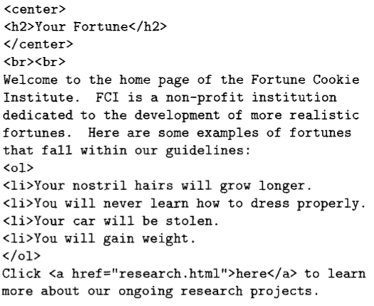
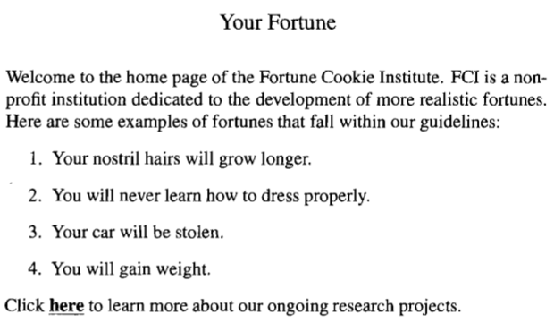
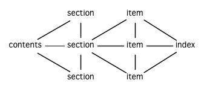

第十六章：示例：生成 HTML
=========================

本章的目标是完成一个简单的 HTML 生成器 ——
这个程序可以自动生成一系列包含超文本链接的网页。除了介绍特定 Lisp
技术之外，本章还是一个典型的自底向上编程（bottom-up
programming）的例子。 我们以一些通用 HTML
实用函数作为开始，继而将这些例程看作是一门编程语言，从而更好地编写这个生成器。

16.1 超文本标记语言 (HTML)
--------------------------

HTML （HyperText Markup
Language，超文本标记语言）用于构建网页，是一种简单、易学的语言。本节就对这种语言作概括性介绍。

当你使用*网页浏览器*阅览网页时，浏览器从远程服务器获取 HTML
文件，并将它们显示在你的屏幕上。每个 HTML
文件都包含任意多个*标签*（tag），这些标签相当于发送给浏览器的指令。



**图 16.1 一个 HTML 文件**

图 16.1 给出了一个简单的 HTML 文件，图 16.2 展示了这个 HTML
文件在浏览器里显示时大概是什么样子。



**图 16.2 一个网页**

注意在尖角括号之间的文本并没有被显示出来，这些用尖角括号包围的文本就是标签。
HTML 的标签分为两种，一种是成双成对地出现的：

``` {.sourceCode .html}
<tag>...</tag>
```

第一个标签标志着某种情景（environment）的开始，而第二个标签标志着这种情景的结束。
这种标签的一个例子是 `<h2>` ：所有被 `<h2>` 和 `</h2>`
包围的文本，都会使用比平常字体尺寸稍大的字体来显示。

另外一些成双成对出现的标签包括：创建带编号列表的 `<ol>` 标签（ol 代表
ordered list，有序表），令文本居中的 `<center>` 标签，以及创建链接的
`<a>` 标签（a 代表 anchor，锚点）。

被 `<a>` 和 `</a>` 包围的文本就是超文本（hypertext）。
在大多数浏览器上，超文本都会以一种与众不同的方式被凸显出来 ——
它们通常会带有下划线 —— 并且点击这些文本会让浏览器跳转到另一个页面。
在标签 `a` 之后的部分，指示了链接被点击时，浏览器应该跳转到的位置。

一个像

``` {.sourceCode .html}
<a href="foo.html">
```

这样的标签，就标识了一个指向另一个 HTML 文件的链接，其中这个 HTML
文件和当前网页的文件夹相同。 当点击这个链接时，浏览器就会获取并显示
`foo.html` 这个文件。

当然，链接并不一定都要指向相同文件夹下的 HTML
文件，实际上，一个链接可以指向互联网的任何一个文件。

和成双成对出现的标签相反，另一种标签没有结束标记。 在图 16.1
里有一些这样的标签，包括：创建一个新文本行的 `<br>` 标签（br 代表 break
，断行），以及在列表情景中，创建一个新列表项的 `<li>` 标签（li 代表 list
item ，列表项）。

HTML 还有不少其他的标签，但是本章要用到的标签，基本都包含在图 16.1
里了。

16.2 HTML 实用函数 (HTML Utilities)
-----------------------------------

``` {.sourceCode .cl}
(defmacro as (tag content)
  `(format t "<~(~A~)>~A</~(~A~)>"
           ',tag ,content ',tag))

(defmacro with (tag &rest body)
  `(progn
     (format t "~&<~(~A~)>~%" ',tag)
     ,@body
     (format t "~&</~(~A~)>~%" ',tag)))

(defmacro brs (&optional (n 1))
  (fresh-line)
  (dotimes (i n)
    (princ "<br>"))
  (terpri))
```

**图 16.3 标签生成例程**

本节会定义一些生成 HTML 的例程。 图 16.3
包含了三个基本的、生成标签的例程。 所有例程都将它们的输出发送到
`*standard-output*` ；可以通过重新绑定这个变量，将输出重定向到一个文件。

宏 `as` 和 `with` 都用于在标签之间生成表达式。其中 `as`
接受一个字符串，并将它打印在两个标签之间：

    > (as center "The Missing Lambda")
    <center>The Missing Lambda</center>
    NIL

`with` 则接受一个代码体（body of code），并将它放置在两个标签之间：

    > (with center
        (princ "The Unbalanced Parenthesis"))
    <center>
    The Unbalanced Parenthesis
    </center>
    NIL

两个宏都使用了 `~(...~)` 来进行格式化，从而将标签转化为小写字母的标签。
HTML 并不介意标签是大写还是小写，但是在包含许许多多标签的 HTML
文件中，小写字母的标签可读性更好一些。

除此之外， `as` 倾向于将所有输出都放在同一行，而 `with`
则将标签和内容都放在不同的行里。 （使用 `~&`
来进行格式化，以确保输出从一个新行中开始。） 以上这些工作都只是为了让
HTML 更具可读性，实际上，标签之外的空白并不影响页面的显示方式。

图 16.3 中的最后一个例程 `brs` 用于创建多个文本行。
在很多浏览器中，这个例程都可以用于控制垂直间距。

``` {.sourceCode .cl}
(defun html-file (base)
  (format nil "~(~A~).html" base))

(defmacro page (name title &rest body)
  (let ((ti (gensym)))
    `(with-open-file (*standard-output*
                      (html-file ,name)
                      :direction :output
                      :if-exists :supersede)
       (let ((,ti ,title))
         (as title ,ti)
         (with center
           (as h2 (string-upcase ,ti)))
         (brs 3)
         ,@body))))
```

**图 16.4 HTML 文件生成例程**

图 16.4 包含用于生成 HTML 文件的例程。
第一个函数根据给定的符号（symbol）返回一个文件名。
在一个实际应用中，这个函数可能会返回指向某个特定文件夹的路径（path）。
目前来说，这个函数只是简单地将 `.html` 后缀追加到给定符号名的后边。

宏 `page` 负责生成整个页面，它的实现和 `with-open-file` 很相似： `body`
中的表达式会被求值，求值的结果通过 `*standard-output*`
所绑定的流，最终被写入到相应的 HTML 文件中。

6.7 小节展示了如何临时性地绑定一个特殊变量。 在 113 页的例子中，我们在
`let` 的体内将 `*print-base*` 绑定为 `16` 。 这一次，通过将
`*standard-output*` 和一个指向 HTML 文件的流绑定，只要我们在 `page`
的函数体内调用 `as` 或者 `princ` ，输出就会被传送到 HTML 文件里。

`page` 宏的输出先在顶部打印 `title` ，接着求值 `body` 中的表达式，打印
`body` 部分的输出。

如果我们调用

    (page 'paren "The Unbalanced Parenthesis"
      (princ "Something in his expression told her..."))

这会产生一个名为 `paren.html` 的文件（文件名由 `html-file`
函数生成），文件中的内容为：

``` {.sourceCode .html}
<title>The Unbalanced Parenthesis</title>
<center>
<h2>THE UNBALANCED PARENTHESIS</h2>
</center>
<br><br><br>
Something in his expression told her...
```

除了 `title` 标签以外，以上输出的所有 HTML 标签在前面已经见到过了。 被
`<title>`
标签包围的文本并不显示在网页之内，它们会显示在浏览器窗口，用作页面的标题。

``` {.sourceCode .cl}
(defmacro with-link (dest &rest body)
  `(progn
     (format t "<a href=\"~A\">" (html-file ,dest))
     ,@body
     (princ "</a>")))

(defun link-item (dest text)
  (princ "<li>")
  (with-link dest
    (princ text)))

(defun button (dest text)
  (princ "[ ")
  (with-link dest
    (princ text))
  (format t " ]~%"))
```

**图 16.5 生成链接的例程**

图片 16.5 给出了用于生成链接的例程。 `with-link` 和 `with`
很相似：它根据给定的地址 `dest` ，创建一个指向 HTML 文件的链接。
而链接内部的文本，则通过求值 `body` 参数中的代码段得出：

    > (with-link 'capture
        (princ "The Captured Variable"))
    <a href="capture.html">The Captured Variable</a>
    "</a>"

`with-link` 也被用在 `link-item`
当中，这个函数接受一个字符串，并创建一个带链接的列表项：

    > (link-item 'bq "Backquote!")
    <li><a href="bq.html">Backquote!</a>
    "</a>"

最后， `button` 也使用了 `with-link` ，从而创建一个被方括号包围的链接：

    > (button 'help "Help")
    [ <a href="help.html">Help</a> ]
    NIL

16.3 迭代式实用函数 (An Iteration Utility)
------------------------------------------

在这一节，我们先暂停一下编写 HTML
生成器的工作，转到编写迭代式例程的工作上来。

你可能会问，怎样才能知道，什么时候应该编写主程序，什么时候又应该编写子例程？

实际上，这个问题，没有答案。

通常情况下，你总是先开始写一个程序，然后发现需要写一个新的例程，于是你转而去编写新例程，完成它，接着再回过头去编写原来的程序。
时间关系，要在这里演示这个开始-完成-又再开始的过程是不太可能的，这里只展示这个迭代式例程的最终形态，需要注意的是，这个程序的编写并不如想象中的那么简单。
程序通常需要经历多次重写，才会变得简单。

``` {.sourceCode .cl}
(defun map3 (fn lst)
  (labels ((rec (curr prev next left)
             (funcall fn curr prev next)
             (when left
               (rec (car left)
                    curr
                    (cadr left)
                    (cdr left)))))
    (when lst
      (rec (car lst) nil (cadr lst) (cdr lst)))))
```

**图 16.6 对树进行迭代**

图 16.6 里定义的新例程是 `mapc`
的一个变种。它接受一个函数和一个列表作为参数，对于传入列表中的每个元素，它都会用三个参数来调用传入函数，分别是元素本身，前一个元素，以及后一个元素。（当没有前一个元素或者后一个元素时，使用
`nil` 代替。）

``` {.sourceCode .cl}
> (map3 #'(lambda (&rest args) (princ args))
        '(a b c d))
(A NIL B) (B A C) (C B D) (D C NIL)
NIL
```

和 `mapc` 一样， `map3` 总是返回 `nil`
作为函数的返回值。需要这类例程的情况非常多。在下一个小节就会看到，这个例程是如何让每个页面都实现“前进一页”和“后退一页”功能的。

`map3` 的一个常见功能是，在列表的两个相邻元素之间进行某些处理：

``` {.sourceCode .cl}
> (map3 #'(lambda (c p n)
            (princ c)
            (if n (princ " | ")))
        '(a b c d))
A | B | C | D
NIL
```

程序员经常会遇到上面的这类问题，但只要花些功夫，定义一些例程来处理它们，就能为后续工作节省不少时间。

16.4 生成页面 (Generating Pages)
--------------------------------

一本书可以有任意数量的大章，每个大章又有任意数量的小节，而每个小节又有任意数量的分节，整本书的结构呈现出一棵树的形状。

尽管网页使用的术语和书本不同，但多个网页同样可以被组织成树状。

本节要构建的是这样一个程序，它生成多个网页，这些网页带有以下结构：
第一页是一个目录，目录中的链接指向各个*节点*（section）页面。
每个节点包含一些指向*项*（item）的链接。
而一个项就是一个包含纯文本的页面。

除了页面本身的链接以外，根据页面在树状结构中的位置，每个页面都会带有前进、后退和向上的链接。
其中，前进和后退链接用于在同级（sibling）页面中进行导航。
举个例子，点击一个项页面中的前进链接时，如果这个项的同一个节点下还有下一个项，那么就跳到这个新项的页面里。
另一方面，向上链接将页面跳转到树形结构的上一层 ——
如果当前页面是项页面，那么返回到节点页面；如果当前页面是节点页面，那么返回到目录页面。
最后，还会有索引页面：这个页面包含一系列链接，按字母顺序排列所有项。



**图 16.7 网站的结构**

图 16.7 展示了生成程序创建的页面所形成的链接结构。

``` {.sourceCode .cl}
(defparameter *sections* nil)

(defstruct item
  id title text)

(defstruct section
  id title items)

(defmacro defitem (id title text)
  `(setf ,id
         (make-item :id     ',id
                    :title  ,title
                    :text   ,text)))

(defmacro defsection (id title &rest items)
  `(setf ,id
         (make-section :id    ',id
                       :title ,title
                       :items (list ,@items))))

(defun defsite (&rest sections)
  (setf *sections* sections))
```

**图 16.8 定义一个网站**

图 16.8
包含定义页面所需的数据结构。程序需要处理两类对象：项和节点。这两类对象的结构很相似，不过节点包含的是项的列表，而项包含的是文本块。

节点和项两类对象都带有 `id` 域。
标识符（id）被用作符号（symbol），并达到以下两个目的：在 `defitem` 和
`defsection` 的定义中，
标识符会被设置到被创建的项或者节点当中，作为我们引用它们的一种手段；另一方面，标识符还会作为相应文件的前缀名（base
name），比如说，如果项的标识符为 `foo` ，那么项就会被写到 `foo.html`
文件当中。

节点和项也同时带有 `title`
域。这个域的值应该为字符串，并且被用作相应页面的标题。

在节点里，项的排列顺序由传给 `defsection` 的参数决定。
与此类似，在目录里，节点的排列顺序由传给 `defsite` 的参数决定。

``` {.sourceCode .cl}
(defconstant contents "contents")
(defconstant index    "index")

(defun gen-contents (&optional (sections *sections*))
  (page contents contents
    (with ol
      (dolist (s sections)
        (link-item (section-id s) (section-title s))
        (brs 2))
      (link-item index (string-capitalize index)))))

(defun gen-index (&optional (sections *sections*))
  (page index index
    (with ol
      (dolist (i (all-items sections))
        (link-item (item-id i) (item-title i))
        (brs 2)))))

(defun all-items (sections)
  (let ((is nil))
    (dolist (s sections)
      (dolist (i (section-items s))
        (setf is (merge 'list (list i) is #'title<))))
    is))

(defun title< (x y)
  (string-lessp (item-title x) (item-title y)))
```

**图 16.9 生成索引和目录**

图 16.9 包含的函数用于生成索引和目录。 常量 `contents` 和 `index`
都是字符串，它们分别用作 `contents` 页面的标题和 `index`
页面的标题；另一方面，如果有其他页面包含了目录和索引这两个页面，那么这两个常量也会作为这些页面文件的前缀名。

函数 `gen-contents` 和 `gen-index` 非常相似。 它们都打开一个 HTML
文件，生成标题和链接列表。 不同的地方是，索引页面的项必须是有序的。
有序列表通过 `all-items`
函数生成，它遍历各个项并将它加入到保存已知项的列表当中，并使用 `title<`
函数作为排序函数。 注意，因为 `title<`
函数对大小写敏感，所以在对比标题前，输入必须先经过 `string-lessp`
处理，从而忽略大小写区别。

实际程序中的对比操作通常更复杂一些。举个例子，它们需要忽略无意义的句首词汇，比如
`"a"` 和 `"the"` 。

``` {.sourceCode .cl}
(defun gen-site ()
  (map3 #'gen-section *sections*)
  (gen-contents)
  (gen-index))

(defun gen-section (sect <sect sect>)
  (page (section-id sect) (section-title sect)
    (with ol
      (map3 #'(lambda (item <item item>)
                (link-item (item-id item)
                           (item-title item))
                (brs 2)
                (gen-item sect item <item item>))
            (section-items sect)))
    (brs 3)
    (gen-move-buttons (if <sect (section-id <sect))
                      contents
                      (if sect> (section-id sect>)))))

(defun gen-item (sect item <item item>)
  (page (item-id item) (item-title item)
    (princ (item-text item))
    (brs 3)
    (gen-move-buttons (if <item (item-id <item))
                      (section-id sect)
                      (if item> (item-id item>)))))

(defun gen-move-buttons (back up forward)
  (if back (button back "Back"))
  (if up (button up "Up"))
  (if forward (button forward "Forward")))
```

**图 16.10 生成网站、节点和项**

图 16.10 包含其余的代码： `gen-site`
生成整个页面集合，并调用相应的函数，生成节点和项。

所有页面的集合包括目录、索引、各个节点以及各个项的页面。
目录和索引的生成由图 16.9 中的代码完成。 节点和项由分别由生成节点页面的
`gen-section` 和生成项页面的 `gen-item` 完成。

这两个函数的开头和结尾非常相似。
它们都接受一个对象、对象的左兄弟、对象的右兄弟作为参数；它们都从对象的
`title` 域中提取标题内容；它们都以调用 `gen-move-buttons` 作为结束，其中
`gen-move-buttons`
创建指向左兄弟的后退按钮、指向右兄弟的前进按钮和指向双亲（parent）对象的向上按钮。
它们的不同在于函数体的中间部分： `gen-section`
创建有序列表，列表中的链接指向节点包含的项，而 `gen-item`
创建的项则链接到相应的文本页面。

项所包含的内容完全由用户决定。 比如说，将 HTML
标签作为内容也是完全没问题的。 项的文本当然也可以由其他程序来生成。

图 16.11 演示了如何手工地定义一个微型网页。 在这个例子中，列出的项都是
Fortune 饼干公司新推出的产品。

``` {.sourceCode .cl}
(defitem des "Fortune Cookies: Dessert or Fraud?" "...")

(defitem case "The Case for Pessimism" "...")

(defsection position "Position Papers" des case)

(defitem luck "Distribution of Bad Luck" "...")

(defitem haz "Health Hazards of Optimism" "...")

(defsection abstract "Research Abstracts" luck haz)

(defsite position abstract)
```

**图 16.11 一个微型网站**
