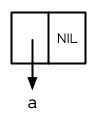
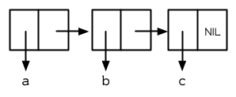
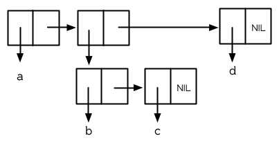
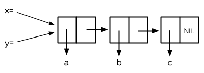
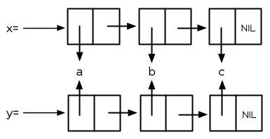
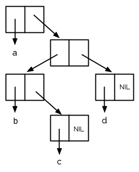
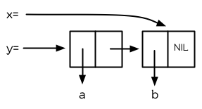
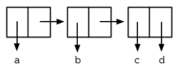

第三章：列表
============

列表是 Lisp 的基本数据结构之一。在最早的 Lisp
方言里，列表是唯一的数据结构： “Lisp” 这个名字起初是 “LISt Processor”
的缩写。但 Lisp 已经超越这个缩写很久了。 Common Lisp
是一个有着各式各样数据结构的通用性程序语言。

Lisp 程序开发通常呼应着开发 Lisp 语言自身。在最初版本的 Lisp
程序，你可能使用很多列表。然而之后的版本，你可能换到快速、特定的数据结构。本章描述了你可以用列表所做的很多事情，以及使用它们来演示一些普遍的
Lisp 概念。

3.1 构造 (Conses)
-----------------

在 2.4 节我们介绍了 `cons` , `car` , 以及 `cdr` ，基本的 List 操作函数。
`cons` 真正所做的事情是，把两个对象结合成一个有两部分的对象，称之为
*Cons* 对象。概念上来说，一个 *Cons* 是一对指针；第一个是 `car`
，第二个是 `cdr` 。

*Cons* 对象提供了一个方便的表示法，来表示任何类型的对象。一个 *Cons*
对象里的一对指针，可以指向任何类型的对象，包括 *Cons*
对象本身。它利用到我们之后可以用 `cons` 来构造列表的可能性。

我们往往不会把列表想成是成对的，但它们可以这样被定义。任何非空的列表，都可以被视为一对由列表第一个元素及列表其余元素所组成的列表。
Lisp 列表体现了这个概念。我们使用 *Cons*
的一半来指向列表的第一个元素，然后用另一半指向列表其余的元素(可能是别的
*Cons* 或 `nil` )。 Lisp 的惯例是使用 `car` 代表列表的第一个元素，而用
`cdr` 代表列表的其余的元素。所以现在 `car`
是列表的第一个元素的同义词，而 `cdr`
是列表的其余的元素的同义词。列表不是不同的对象，而是像 *Cons*
这样的方式连结起来。

当我们想在 `nil` 上面建立东西时，

    > (setf x (cons 'a nil))
    (A)

图 3.1 一个元素的列表

产生的列表由一个 *Cons* 所组成，见图 3.1。这种表达 *Cons*
的方式叫做箱子表示法 (box notation)，因为每一个 Cons
是用一个箱子表示，内含一个 `car` 和 `cdr` 的指针。当我们调用 `car` 与
`cdr` 时，我们得到指针指向的地方：

    > (car x)
    A
    > (cdr x)
    NIL

当我们构造一个多元素的列表时，我们得到一串 *Cons* (a chain of conses):

    > (setf y (list 'a 'b 'c))
    (A B C)

产生的结构见图 3.2。现在当我们想得到列表的 `cdr`
时，它是一个两个元素的列表。

图 3.2 三个元素的列表

    > (cdr y)
    (B C)

在一个有多个元素的列表中， `car` 指针让你取得元素，而 `cdr`
让你取得列表内其余的东西。

一个列表可以有任何类型的对象作为元素，包括另一个列表：

    > (setf z (list 'a (list 'b 'c) 'd))
    (A (B C) D)

当这种情况发生时，它的结构如图 3.3 所示；第二个 *Cons* 的 `car`
指针也指向一个列表：

    > (car (cdr z))
    (B C)

图 3.3 嵌套列表

前两个我们构造的列表都有三个元素；只不过 `z`
列表的第二个元素也刚好是一个列表。像这样的列表称为*嵌套*列表，而像 `y`
这样的列表称之为*平坦*列表 (*flat*list)。

如果参数是一个 *Cons* 对象，函数 `consp` 返回真。所以我们可以这样定义
`listp` :

    (defun our-listp (x)
      (or (null x) (consp x)))

因为所有不是 *Cons* 对象的东西，就是一个原子 (atom)，判断式 `atom`
可以这样定义：

    (defun our-atom (x) (not (consp x)))

注意， `nil` 既是一个原子，也是一个列表。

3.2 等式 (Equality)
-------------------

每一次你调用 `cons` 时， Lisp
会配置一块新的内存给两个指针。所以如果我们用同样的参数调用 `cons`
两次，我们得到两个数值看起来一样，但实际上是两个不同的对象：

    > (eql (cons 'a nil) (cons 'a nil))
    NIL

如果我们也可以询问两个列表是否有相同元素，那就很方便了。 Common Lisp
提供了这种目的另一个判断式： `equal` 。而另一方面 `eql`
只有在它的参数是相同对象时才返回真，

    > (setf x (cons 'a nil))
    (A)
    > (eql x x)
    T

本质上 `equal` 若它的参数打印出的值相同时，返回真：

    > (equal x (cons 'a nil))
    T

这个判断式对非列表结构的别种对象也有效，但一种仅对列表有效的版本可以这样定义：

    > (defun our-equal (x y)
        (or (eql x y)
            (and (consp x)
                 (consp y)
                 (our-equal (car x) (car y))
                 (our-equal (cdr x) (cdr y)))))

这个定义意味着，如果某个 `x` 和 `y` 相等( `eql` )，那么他们也相等(
`equal` )。

**勘误:** 这个版本的 `our-equal` 可以用在符号的列表 (list of
symbols)，而不是列表 (list)。

3.3 为什么 Lisp 没有指针 (Why Lisp Has No Pointers)
---------------------------------------------------

一个理解 Lisp 的秘密之一是意识到变量是有值的，就像列表有元素一样。如同
*Cons* 对象有指针指向他们的元素，变量有指针指向他们的值。

你可能在别的语言中使用过显式指针 (explicitly pointer)。在
Lisp，你永远不用这么做，因为语言帮你处理好指针了。我们已经在列表看过这是怎么实现的。同样的事情发生在变量身上。举例来说，假设我们想要把两个变量设成同样的列表：

    > (setf x '(a b c))

> (A B C) \> (setf y x) (A B C)

图 3.4 两个变量设为相同的列表

当我们把 `x` 的值赋给 `y` 时，究竟发生什么事呢？内存中与 `x`
有关的位置并没有包含这个列表，而是一个指针指向它。当我们给 `y`
赋一个相同的值时， Lisp 复制的是指针，而不是列表。（图 3.4 显式赋值 `x`
给 `y`
后的结果）无论何时，你将某个变量的值赋给另个变量时，两个变量的值将会是
`eql` 的：

    > (eql x y)
    T

Lisp
没有指针的原因是因为每一个值，其实概念上来说都是一个指针。当你赋一个值给变量或将这个值存在数据结构中，其实被储存的是指向这个值的指针。当你要取得变量的值，或是存在数据结构中的内容时，
Lisp
返回指向这个值的指针。但这都在台面下发生。你可以不加思索地把值放在结构里，或放“在”变量里。

为了效率的原因， Lisp
有时会选择一个折衷的表示法，而不是指针。举例来说，因为一个小整数所需的内存空间，少于一个指针所需的空间，一个
Lisp
实现可能会直接处理这个小整数，而不是用指针来处理。但基本要点是，程序员预设可以把任何东西放在任何地方。除非你声明你不愿这么做，不然你能够在任何的数据结构，存放任何类型的对象，包括结构本身。

3.4 建立列表 (Building Lists)
-----------------------------

图 3.5 复制的结果

函数 `copy-list`
接受一个列表，然后返回此列表的复本。新的列表会有同样的元素，但是装在新的
*Cons* 对象里：

    > (setf x '(a b c)
            y (copy-list x))
    (A B C)

图 3.5 展示出结果的结构; 返回值像是有着相同乘客的新公交。我们可以把
`copy-list` 想成是这么定义的：

    (defun our-copy-list (lst)
     (if (atom lst)
         lst
         (cons (car lst) (our-copy-list (cdr lst)))))

这个定义暗示着 `x` 与 `(copy-list x)` 会永远 `equal` ，并永远不 `eql`
，除非 `x` 是 `NIL` 。

最后，函数 `append` 返回任何数目的列表串接 (concatenation)：

    > (append '(a b) '(c d) 'e)
    (A B C D . E)

通过这么做，它复制所有的参数，除了最后一个

3.5 示例：压缩 (Example: Compression)
-------------------------------------

作为一个例子，这节将演示如何实现简单形式的列表压缩。这个算法有一个令人印象深刻的名字，*游程编码*(run-length
encoding)。

    (defun compress (x)
      (if (consp x)
          (compr (car x) 1 (cdr x))
          x))

    (defun compr (elt n lst)
      (if (null lst)
          (list (n-elts elt n))
          (let ((next (car lst)))
            (if (eql next elt)
                (compr elt (+ n 1) (cdr lst))
                (cons (n-elts elt n)
                      (compr next 1 (cdr lst)))))))

    (defun n-elts (elt n)
      (if (> n 1)
          (list n elt)
          elt))

图 3.6 游程编码 (Run-length encoding)：压缩

在餐厅的情境下，这个算法的工作方式如下。一个女服务生走向有四个客人的桌子。“你们要什么？”
她问。“我要特餐，” 第一个客人说。 “我也是，”
第二个客人说。“听起来不错，” 第三个客人说。每个人看着第四个客人。
“我要一个 cilantro soufflé，” 他小声地说。
(译注：蛋奶酥上面洒香菜跟酱料）

瞬息之间，女服务生就转身踩着高跟鞋走回柜台去了。 “三个特餐，”
她大声对厨师说，“还有一个香菜蛋奶酥。”

图 3.6 展示了如何实现这个压缩列表演算法。函数 `compress`
接受一个由原子组成的列表，然后返回一个压缩的列表：

    > (compress '(1 1 1 0 1 0 0 0 0 1))
    ((3 1) 0 1 (4 0) 1)

当相同的元素连续出现好几次，这个连续出现的序列
(sequence)被一个列表取代，列表指明出现的次数及出现的元素。

主要的工作是由递归函数 `compr` 所完成。这个函数接受三个参数： `elt` ，
上一个我们看过的元素； `n` ，连续出现的次数；以及 `lst`
，我们还没检查过的部分列表。如果没有东西需要检查了，我们调用 `n-elts`
来取得 `n elts` 的表示法。如果 `lst` 的第一个元素还是 `elt`
，我们增加出现的次数 `n`
并继续下去。否则我们得到，到目前为止的一个压缩的列表，然后 `cons`
这个列表在 `compr` 处理完剩下的列表所返回的东西之上。

要复原一个压缩的列表，我们调用 `uncompress` (图 3.7)

    > (uncompress '((3 1) 0 1 (4 0) 1))
    (1 1 1 0 1 0 0 0 0 1)

    (defun uncompress (lst)
      (if (null lst)
          nil
          (let ((elt (car lst))
                (rest (uncompress (cdr lst))))
            (if (consp elt)
                (append (apply #'list-of elt)
                        rest)
                (cons elt rest)))))

    (defun list-of (n elt)
      (if (zerop n)
          nil
          (cons elt (list-of (- n 1) elt))))

图 3.7 游程编码 (Run-length encoding)：解压缩

这个函数递归地遍历这个压缩列表，逐字复制原子并调用 `list-of`
，展开成列表。

    > (list-of 3 'ho)
    (HO HO HO)

我们其实不需要自己写 `list-of` 。内置的 `make-list` 可以办到一样的事情
── 但它使用了我们还没介绍到的关键字参数 (keyword argument)。

图 3.6 跟 3.7 这种写法不是一个有经验的Lisp
程序员用的写法。它的效率很差，它没有尽可能的压缩，而且它只对由原子组成的列表有效。在几个章节内，我们会学到解决这些问题的技巧。

    载入程序

    在这节的程序是我们第一个实质的程序。
    当我们想要写超过数行的函数时，
    通常我们会把程序写在一个文件，
    然后使用 load 让 Lisp 读取函数的定义。
    如果我们把图 3.6 跟 3.7 的程序，
    存在一个文件叫做，“compress.lisp”然后输入

    (load "compress.lisp")

    到顶层，或多或少的，
    我们会像在直接输入顶层一样得到同样的效果。

    注意：在某些实现中，Lisp 文件的扩展名会是“.lsp”而不是“.lisp”。

3.6 存取 (Access)
-----------------

Common Lisp 有额外的存取函数，它们是用 `car` 跟 `cdr`
所定义的。要找到列表特定位置的元素，我们可以调用 `nth` ，

    > (nth 0 '(a b c))
    A

而要找到第 `n` 个 `cdr` ，我们调用 `nthcdr` ：

    > (nthcdr 2 '(a b c))
    (C)

`nth` 与 `nthcdr` 都是零索引的 (zero-indexed); 即元素从 `0`
开始编号，而不是从 `1` 开始。在 Common Lisp
里，无论何时你使用一个数字来参照一个数据结构中的元素时，都是从 `0`
开始编号的。

两个函数几乎做一样的事; `nth` 等同于取 `nthcdr` 的 `car`
。没有检查错误的情况下， `nthcdr` 可以这么定义：

    (defun our-nthcdr (n lst)
      (if (zerop n)
          lst
          (our-nthcdr (- n 1) (cdr lst))))

函数 `zerop` 仅在参数为零时，才返回真。

函数 `last` 返回列表的最后一个 *Cons* 对象：

    > (last '(a b c))
    (C)

这跟取得最后一个元素不一样。要取得列表的最后一个元素，你要取得 `last` 的
`car` 。

Common Lisp 定义了函数 `first` 直到 `tenth`
可以取得列表对应的元素。这些函数不是 *零索引的* (zero-indexed)：

`(second x)` 等同于 `(nth 1 x)` 。

此外， Common Lisp 定义了像是 `caddr` 这样的函数，它是 `cdr` 的 `cdr` 的
`car` 的缩写 ( `car` of `cdr` of `cdr` )。所有这样形式的函数 `cxr`
，其中 x 是一个字符串，最多四个 `a` 或 `d` ，在 Common Lisp
里都被定义好了。使用 `cadr` 可能会有异常
(exception)产生，在所有人都可能会读的代码里使用这样的函数，可能不是个好主意。

3.7 映射函数 (Mapping Functions)
--------------------------------

Common Lisp 提供了数个函数来对一个列表的元素做函数调用。最常使用的是
`mapcar`
，接受一个函数以及一个或多个列表，并返回把函数应用至每个列表的元素的结果，直到有的列表没有元素为止：

    > (mapcar #'(lambda (x) (+ x 10))
              '(1 2 3))
    (11 12 13)

    > (mapcar #'list
              '(a b c)
              '(1 2 3 4))
    ((A 1) (B 2) (C 3))

相关的 `maplist` 接受同样的参数，将列表的渐进的下一个 `cdr` 传入函数。

    > (maplist #'(lambda (x) x)
               '(a b c))
    ((A B C) (B C) (C))

其它的映射函数，包括 `mapc` 我们在 89 页讨论（译注：5.4 节最后），以及
`mapcan` 在 202 页（译注：12.4 节最后）讨论。

3.8 树 (Trees)
--------------

*Cons* 对象可以想成是二叉树， `car` 代表左子树，而 `cdr`
代表右子树。举例来说，列表

`(a (b c) d)` 也是一棵由图 3.8 所代表的树。 （如果你逆时针旋转 45
度，你会发现跟图 3.3 一模一样）

图 3.8 二叉树 (Binary Tree)

Common Lisp 有几个内置的操作树的函数。举例来说， `copy-tree`
接受一个树，并返回一份副本。它可以这么定义：

    (defun our-copy-tree (tr)
      (if (atom tr)
           tr
           (cons (our-copy-tree (car tr))
                 (our-copy-tree (cdr tr)))))

把这跟 36 页的 `copy-list` 比较一下； `copy-tree` 复制每一个 *Cons*
对象的 `car` 与 `cdr` ，而 `copy-list` 仅复制 `cdr` 。

没有内部节点的二叉树没有太大的用处。 Common Lisp
包含了操作树的函数，不只是因为我们需要树这个结构，而是因为我们需要一种方法，来操作列表及所有内部的列表。举例来说，假设我们有一个这样的列表：

    (and (integerp x) (zerop (mod x 2)))

而我们想要把各处的 `x` 都换成 `y` 。调用 `substitute`
是不行的，它只能替换序列 (sequence)中的元素：

    > (substitute 'y 'x '(and (integerp x) (zerop (mod x 2))))
    (AND (INTEGERP X) (ZEROP (MOD X 2)))

这个调用是无效的，因为列表有三个元素，没有一个元素是 `x`
。我们在这所需要的是 `subst` ，它替换树之中的元素。

    > (subst 'y 'x '(and (integerp x) (zerop (mod x 2))))
    (AND (INTEGERP Y) (ZEROP (MOD Y 2)))

如果我们定义一个 `subst` 的版本，它看起来跟 `copy-tree` 很相似：

    > (defun our-subst (new old tree)
        (if (eql tree old)
            new
            (if (atom tree)
                tree
                (cons (our-subst new old (car tree))
                      (our-subst new old (cdr tree))))))

操作树的函数通常有这种形式， `car` 与 `cdr`
同时做递归。这种函数被称之为是 *双重递归* (doubly recursive)。

3.9 理解递归 (Understanding Recursion)
--------------------------------------

学生在学习递归时，有时候是被鼓励在纸上追踪 (trace)递归程序调用
(invocation)的过程。 (288页「译注：[附录 A
追踪与回溯](http://acl.readthedocs.org/en/latest/zhCN/appendix-A-cn.html)」可以看到一个递归函数的追踪过程。)但这种练习可能会误导你：一个程序员在定义一个递归函数时，通常不会特别地去想函数的调用顺序所导致的结果。

如果一个人总是需要这样子思考程序，递归会是艰难的、没有帮助的。递归的优点是它精确地让我们更抽象地来设计算法。你不需要考虑真正函数时所有的调用过程，就可以判断一个递归函数是否是正确的。

要知道一个递归函数是否做它该做的事，你只需要问，它包含了所有的情况吗？举例来说，下面是一个寻找列表长度的递归函数：

    > (defun len (lst)
        (if (null lst)
            0
            (+ (len (cdr lst)) 1)))

我们可以借由检查两件事情，来确信这个函数是正确的：

1.  对长度为 `0` 的列表是有效的。
2.  给定它对于长度为 `n` 的列表是有效的，它对长度是 `n+1`
    的列表也是有效的。

如果这两点是成立的，我们知道这个函数对于所有可能的列表都是正确的。

我们的定义显然地满足第一点：如果列表( `lst` ) 是空的( `nil`
)，函数直接返回 `0` 。现在假定我们的函数对长度为 `n`
的列表是有效的。我们给它一个 `n+1`
长度的列表。这个定义说明了，函数会返回列表的 `cdr` 的长度再加上 `1` 。
`cdr` 是一个长度为 `n` 的列表。我们经由假定可知它的长度是 `n`
。所以整个列表的长度是 `n+1` 。

我们需要知道的就是这些。理解递归的秘密就像是处理括号一样。你怎么知道哪个括号对上哪个？你不需要这么做。你怎么想像那些调用过程？你不需要这么做。

更复杂的递归函数，可能会有更多的情况需要讨论，但是流程是一样的。举例来说，
41 页的 `our-copy-tree` ，我们需要讨论三个情况： 原子，单一的 *Cons*
对象， `n+1` 的 *Cons* 树。

第一个情况（长度零的列表）称之为*基本用例*( *base case*
)。当一个递归函数不像你想的那样工作时，通常是处理基本用例就错了。下面这个不正确的
`member` 定义，是一个常见的错误，整个忽略了基本用例：

    (defun our-member (obj lst)
      (if (eql (car lst) obj)
          lst
          (our-member obj (cdr lst))))

我们需要初始一个 `null`
测试，确保在到达列表底部时，没有找到目标时要停止递归。如果我们要找的对象没有在列表里，这个版本的
`member` 会陷入无穷循环。附录 A 更详细地讨论了这种问题。

能够判断一个递归函数是否正确只不过是理解递归的上半场，下半场是能够写出一个做你想做的事情的递归函数。
6.9 节讨论了这个问题。

3.10 集合 (Sets)
----------------

列表是表示小集合的好方法。列表中的每个元素都代表了一个集合的成员：

    > (member 'b '(a b c))
    (B C)

当 `member` 要返回“真”时，与其仅仅返回 `t`
，它返回由寻找对象所开始的那部分。逻辑上来说，一个 *Cons* 扮演的角色和
`t` 一样，而经由这么做，函数返回了更多资讯。

一般情况下， `member` 使用 `eql`
来比较对象。你可以使用一种叫做关键字参数的东西来重写缺省的比较方法。多数的
Common Lisp
函数接受一个或多个关键字参数。这些关键字参数不同的地方是，他们不是把对应的参数放在特定的位置作匹配，而是在函数调用中用特殊标签，称为关键字，来作匹配。一个关键字是一个前面有冒号的符号。

一个 `member` 函数所接受的关键字参数是 `:test` 参数。

如果你在调用 `member` 时，传入某个函数作为 `:test`
参数，那么那个函数就会被用来比较是否相等，而不是用 `eql`
。所以如果我们想找到一个给定的对象与列表中的成员是否相等( `equal`
)，我们可以：

    > (member '(a) '((a) (z)) :test #'equal)
    ((A) (Z))

关键字参数总是选择性添加的。如果你在一个调用中包含了任何的关键字参数，他们要摆在最后;
如果使用了超过一个的关键字参数，摆放的顺序无关紧要。

另一个 `member` 接受的关键字参数是 `:key`
参数。借由提供这个参数，你可以在作比较之前，指定一个函数运用在每一个元素：

    > (member 'a '((a b) (c d)) :key #'car)
    ((A B) (C D))

在这个例子里，我们询问是否有一个元素的 `car` 是 `a` 。

如果我们想要使用两个关键字参数，我们可以使用其中一个顺序。下面这两个调用是等价的：

    > (member 2 '((1) (2)) :key #'car :test #'equal)
    ((2))
    > (member 2 '((1) (2)) :test #'equal :key #'car)
    ((2))

两者都询问是否有一个元素的 `car` 等于( `equal` ) 2。

如果我们想要找到一个元素满足任意的判断式像是── `oddp`
，奇数返回真──我们可以使用相关的 `member-if` ：

    > (member-if #'oddp '(2 3 4))
    (3 4)

我们可以想像一个限制性的版本 `member-if` 是这样写成的：

    (defun our-member-if (fn lst)
      (and (consp lst)
           (if (funcall fn (car lst))
               lst
               (our-member-if fn (cdr lst)))))

函数 `adjoin` 像是条件式的 `cons`
。它接受一个对象及一个列表，如果对象还不是列表的成员，才构造对象至列表上。

    > (adjoin 'b '(a b c))
    (A B C)
    > (adjoin 'z '(a b c))
    (Z A B C)

通常的情况下它接受与 `member` 函数同样的关键字参数。

集合论中的并集 (union)、交集 (intersection)以及补集
(complement)的实现，是由函数 `union` 、 `intersection` 以及
`set-difference` 。

这些函数期望两个（正好 2 个）列表（一样接受与 `member`
函数同样的关键字参数）。

    > (union '(a b c) '(c b s))
    (A C B S)
    > (intersection '(a b c) '(b b c))
    (B C)
    > (set-difference '(a b c d e) '(b e))
    (A C D)

因为集合中没有顺序的概念，这些函数不需要保留原本元素在列表被找到的顺序。举例来说，调用
`set-difference` 也有可能返回 `(d c a)` 。

3.11 序列 (Sequences)
---------------------

另一种考虑一个列表的方式是想成一系列有特定顺序的对象。在 Common Lisp
里，*序列*( *sequences* )包括了列表与向量
(vectors)。本节介绍了一些可以运用在列表上的序列函数。更深入的序列操作在
4.4 节讨论。

函数 `length` 返回序列中元素的数目。

    > (length '(a b c))
    3

我们在 24 页 (译注：2.13节 `our-length`
)写过这种函数的一个版本（仅可用于列表）。

要复制序列的一部分，我们使用 `subseq`
。第二个（需要的）参数是第一个开始引用进来的元素位置，第三个（选择性）参数是第一个不引用进来的元素位置。

    > (subseq '(a b c d) 1 2)
    (B)
    >(subseq '(a b c d) 1)
    (B C D)

如果省略了第三个参数，子序列会从第二个参数给定的位置引用到序列尾端。

函数 `reverse` 返回与其参数相同元素的一个序列，但顺序颠倒。

    > (reverse '(a b c))
    (C B A)

一个回文 (palindrome) 是一个正读反读都一样的序列 —— 举例来说， `(abba)`
。如果一个回文有偶数个元素，那么后半段会是前半段的镜射 (mirror)。使用
`length` 、 `subseq` 以及 `reverse` ，我们可以定义一个函数

    (defun mirror? (s)
      (let ((len (length s)))
        (and (evenp len)
             (let ((mid (/ len 2)))
               (equal (subseq s 0 mid)
                      (reverse (subseq s mid)))))))

来检测是否是回文：

    > (mirror? '(a b b a))
    T

Common Lisp 有一个内置的排序函数叫做 `sort`
。它接受一个序列及一个比较两个参数的函数，返回一个有同样元素的序列，根据比较函数来排序：

    > (sort '(0 2 1 3 8) #'>)
    (8 3 2 1 0)

你要小心使用 `sort`
，因为它是*破坏性的*(*destructive*)。考虑到效率的因素， `sort`
被允许修改传入的序列。所以如果你不想你本来的序列被改动，传入一个副本。

使用 `sort` 及 `nth` ，我们可以写一个函数，接受一个整数 `n`
，返回列表中第 `n` 大的元素：

    (defun nthmost (n lst)
      (nth (- n 1)
           (sort (copy-list lst) #'>)))

我们把整数减一因为 `nth` 是零索引的，但如果 `nthmost`
是这样的话，会变得很不直观。

    (nthmost 2 '(0 2 1 3 8))

多努力一点，我们可以写出这个函数的一个更有效率的版本。

函数 `every` 和 `some`
接受一个判断式及一个或多个序列。当我们仅输入一个序列时，它们测试序列元素是否满足判断式：

    > (every #'oddp '(1 3 5))
    T
    > (some #'evenp '(1 2 3))
    T

如果它们输入多于一个序列时，判断式必须接受与序列一样多的元素作为参数，而参数从所有序列中一次提取一个：

    > (every #'> '(1 3 5) '(0 2 4))
    T

如果序列有不同的长度，最短的那个序列，决定需要测试的次数。

3.12 栈 (Stacks)
----------------

用 *Cons* 对象来表示的列表，很自然地我们可以拿来实现下推栈 (pushdown
stack)。这太常见了，以致于 Common Lisp 提供了两个宏给堆使用：
`(push x y)` 把 `x` 放入列表 `y` 的前端。而 `(pop x)` 则是将列表 x
的第一个元素移除，并返回这个元素。

两个函数都是由 `setf`
定义的。如果参数是常数或变量，很简单就可以翻译出对应的函数调用。

表达式

`(push obj lst)`

等同于

`(setf lst (cons obj lst))`

而表达式

`(pop lst)`

等同于

    (let ((x (car lst)))
      (setf lst (cdr lst))
      x)

所以，举例来说：

    > (setf x '(b))
    (B)
    > (push 'a x)
    (A B)
    > x
    (A B)
    > (setf y x)
    (A B)
    > (pop x)
    (A)
    > x
    (B)
    > y
    (A B)

以上，全都遵循上述由 `setf` 所给出的相等式。图 3.9
展示了这些表达式被求值后的结构。

图 3.9 push 及 pop 的效果

你可以使用 `push` 来定义一个给列表使用的互动版 `reverse` 。

    (defun our-reverse (lst)
      (let ((acc nil))
        (dolist (elt lst)
          (push elt acc))
        acc))

在这个版本，我们从一个空列表开始，然后把 `lst`
的每一个元素放入空表里。等我们完成时，`lst` 最后一个元素会在最前端。

`pushnew` 宏是 `push` 的变种，使用了 `adjoin` 而不是 `cons` ：

    > (let ((x '(a b)))
        (pushnew 'c x)
        (pushnew 'a x)
        x)

> (C A B)

在这里， `c` 被放入列表，但是 `a` 没有，因为它已经是列表的一个成员了。

3.13 点状列表 (Dotted Lists)
----------------------------

调用 `list` 所构造的列表，这种列表精确地说称之为正规列表(*proper*list
)。一个正规列表可以是 `NIL` 或是 `cdr` 是正规列表的 *Cons*
对象。也就是说，我们可以定义一个只对正规列表返回真的判断式： [^1]

    (defun proper-list? (x)
      (or (null x)
          (and (consp x)
               (proper-list? (cdr x)))))

至目前为止，我们构造的列表都是正规列表。

然而， `cons` 不仅是构造列表。无论何时你需要一个具有两个字段
(field)的列表，你可以使用一个 *Cons* 对象。你能够使用 `car`
来参照第一个字段，用 `cdr` 来参照第二个字段。

    > (setf pair (cons 'a 'b))
    (A . B)

因为这个 *Cons*
对象不是一个正规列表，它用点状表示法来显示。在点状表示法，每个 *Cons*
对象的 `car` 与 `cdr` 由一个句点隔开来表示。这个 *Cons*
对象的结构展示在图 3.10 。

图3.10 一个成对的 *Cons* 对象 (A cons used as a pair)

一个非正规列表的 *Cons* 对象称之为点状列表 (dotted
list)。这不是个好名字，因为非正规列表的 Cons 对象通常不是用来表示列表：
`(a . b)` 只是一个有两部分的数据结构。

你也可以用点状表示法表示正规列表，但当 Lisp
显示一个正规列表时，它会使用普通的列表表示法：

    > '(a . (b . (c . nil)))
    (A B C)

顺道一提，注意列表由点状表示法与图 3.2 箱子表示法的关联性。

还有一个过渡形式 (intermediate
form)的表示法，介于列表表示法及纯点状表示法之间，对于 `cdr` 是点状列表的
*Cons* 对象：

    > (cons 'a (cons 'b (cons 'c 'd)))
    (A B C . D)

图 3.11 一个点状列表 (A dotted list)

这样的 *Cons* 对象看起来像正规列表，除了最后一个 cdr
前面有一个句点。这个列表的结构展示在图 3.11 ; 注意它跟图3.2
是多么的相似。

所以实际上你可以这么表示列表 `(a b)` ，

    (a . (b . nil))
    (a . (b))
    (a b . nil)
    (a b)

虽然 Lisp 总是使用后面的形式，来显示这个列表。

3.14 关联列表 (Assoc-lists)
---------------------------

用 *Cons* 对象来表示映射 (mapping)也是很自然的。一个由 *Cons*
对象组成的列表称之为*关联列表*(*assoc-list*or
*alist*)。这样的列表可以表示一个翻译的集合，举例来说：

    > (setf trans '((+ . "add") (- . "subtract")))
    ((+ . "add") (- . "subtract"))

关联列表很慢，但是在初期的程序中很方便。 Common Lisp 有一个内置的函数
`assoc` ，用来取出在关联列表中，与给定的键值有关联的 *Cons* 对：

    > (assoc '+ trans)
    (+ . "add")
    > (assoc '* trans)
    NIL

如果 `assoc` 没有找到要找的东西时，返回 `nil` 。

我们可以定义一个受限版本的 `assoc` ：

    (defun our-assoc (key alist)
      (and (consp alist)
           (let ((pair (car alist)))
            (if (eql key (car pair))
                pair
                (our-assoc key (cdr alist))))))

和 `member` 一样，实际上的 `assoc` 接受关键字参数，包括 `:test` 和
`:key` 。 Common Lisp 也定义了一个 `assoc-if` 之于 `assoc` ，如同
`member-if` 之于 `member` 一样。

3.15 示例：最短路径 (Example: Shortest Path)
--------------------------------------------

图 3.12 包含一个搜索网络中最短路径的程序。函数 `shortest-path`
接受一个起始节点，目的节点以及一个网络，并返回最短路径，如果有的话。

在这个范例中，节点用符号表示，而网络用含以下元素形式的关联列表来表示：

*(node . neighbors)*

所以由图 3.13 展示的最小网络 (minimal network)可以这样来表示：

`(setf min '((a b c) (b c) (c d)))`

    (defun shortest-path (start end net)
      (bfs end (list (list start)) net))

    (defun bfs (end queue net)
      (if (null queue)
          nil
          (let ((path (car queue)))
            (let ((node (car path)))
              (if (eql node end)
                  (reverse path)
                  (bfs end
                       (append (cdr queue)
                               (new-paths path node net))
                       net))))))

    (defun new-paths (path node net)
      (mapcar #'(lambda (n)
                  (cons n path))
              (cdr (assoc node net))))

图 3.12 广度优先搜索(breadth-first search)

图 3.13 最小网络

要找到从节点 `a` 可以到达的节点，我们可以：

    > (cdr (assoc 'a min))
    (B C)

图 3.12
程序使用广度优先的方式搜索网络。要使用广度优先搜索，你需要维护一个含有未探索节点的队列。每一次你到达一个节点，检查这个节点是否是你要的。如果不是，你把这个节点的子节点加入队列的尾端，并从队列起始选一个节点，从这继续搜索。借由总是把较深的节点放在队列尾端，我们确保网络一次被搜索一层。

图 3.12
中的代码较不复杂地表示这个概念。我们不仅想要找到节点，还想保有我们怎么到那的纪录。所以与其维护一个具有节点的队列
(queue)，我们维护一个已知路径的队列，每个已知路径都是一列节点。当我们从队列取出一个元素继续搜索时，它是一个含有队列前端节点的列表，而不只是一个节点而已。

函数 `bfs`
负责搜索。起初队列只有一个元素，一个表示从起点开始的路径。所以
`shortest-path` 调用 `bfs` ，并传入 `(list (list start))` 作为初始队列。

`bfs` 函数第一件要考虑的事是，是否还有节点需要探索。如果队列为空， `bfs`
返回 `nil` 指出没有找到路径。如果还有节点需要搜索， `bfs`
检查队列前端的节点。如果节点的 `car`
部分是我们要找的节点，我们返回这个找到的路径，并且为了可读性的原因我们反转它。如果我们没有找到我们要找的节点，它有可能在现在节点之后，所以我们把它的子节点（或是每一个子路径）加入队列尾端。然后我们递回地调用
`bfs` 来继续搜寻剩下的队列。

因为 `bfs` 广度优先地搜索，第一个找到的路径会是最短的，或是最短之一：

    > (shortest-path 'a 'd min)
    (A C D)

这是队列在我们连续调用 `bfs` 看起来的样子：

    ((A))
    ((B A) (C A))
    ((C A) (C B A))
    ((C B A) (D C A))
    ((D C A) (D C B A))

在队列中的第二个元素变成下一个队列的第一个元素。队列的第一个元素变成下一个队列尾端元素的
`cdr` 部分。

在图 3.12
的代码不是搜索一个网络最快的方法，但它给出了列表具有多功能的概念。在这个简单的程序中，我们用三种不同的方式使用了列表：我们使用一个符号的列表来表示路径，一个路径的列表来表示在广度优先搜索中的队列
[^2] ，以及一个关联列表来表示网络本身。

3.16 垃圾 (Garbages)
--------------------

有很多原因可以使列表变慢。列表提供了顺序存取而不是随机存取，所以列表取出一个指定的元素比数组慢，同样的原因，录音带取出某些东西比在光盘上慢。电脑内部里，
*Cons*
对象倾向于用指针表示，所以走访一个列表意味着走访一系列的指针，而不是简单地像数组一样增加索引值。但这两个所花的代价与配置及回收
*Cons* 核 (cons cells)比起来小多了。

*自动内存管理*(*Automatic memory management*)是 Lisp
最有价值的特色之一。 Lisp
系统维护着一段內存称之为堆(*Heap*)。系统持续追踪堆当中没有使用的内存，把这些内存发放给新产生的对象。举例来说，函数
`cons` ，返回一个新配置的 *Cons* 对象。从堆中配置内存有时候通称为
*consing* 。

如果内存永远没有释放， Lisp
会因为创建新对象把内存用完，而必须要关闭。所以系统必须周期性地通过搜索堆
(heap)，寻找不需要再使用的内存。不需要再使用的内存称之为垃圾
(*garbage*)，而清除垃圾的动作称为垃圾回收 (*garbage collection*或 GC)。

垃圾是从哪来的？让我们来创造一些垃圾：

    > (setf lst (list 'a 'b 'c))
    (A B C)
    > (setf lst nil)
    NIL

一开始我们调用 `list` ， `list` 调用 `cons` ，在堆上配置了一个新的
*Cons* 对象。在这个情况我们创出三个 *Cons* 对象。之后当我们把 `lst` 设为
`nil` ，我们没有任何方法可以再存取 `lst` ，列表 `(a b c)` 。 [^3]

因为我们没有任何方法再存取列表，它也有可能是不存在的。我们不再有任何方式可以存取的对象叫做垃圾。系统可以安全地重新使用这三个
*Cons* 核。

这种管理內存的方法，给程序员带来极大的便利性。你不用显式地配置
(allocate)或释放
(dellocate)內存。这也表示了你不需要处理因为这么做而可能产生的臭虫。內存泄漏
(Memory leaks)以及迷途指针 (dangling pointer)在 Lisp 中根本不可能发生。

但是像任何的科技进步，如果你不小心的话，自动內存管理也有可能对你不利。使用及回收堆所带来的代价有时可以看做
`cons` 的代价。这是有理的，除非一个程序从来不丢弃任何东西，不然所有的
*Cons* 对象终究要变成垃圾。 Consing
的问题是，配置空间与清除內存，与程序的常规运作比起来花费昂贵。近期的研究提出了大幅改善內存回收的演算法，但是
consing 总是需要代价的，在某些现有的 Lisp 系统中，代价是昂贵的。

除非你很小心，不然很容易写出过度显式创建 cons 对象的程序。举例来说，
`remove` 需要复制所有的 `cons`
核，直到最后一个元素从列表中移除。你可以借由使用破坏性的函数避免某些
consing，它试着去重用列表的结构作为参数传给它们。破坏性函数会在 12.4
节讨论。

当写出 `cons` 很多的程序是如此简单时，我们还是可以写出不使用 `cons`
的程序。典型的方法是写出一个纯函数风格，使用很多列表的第一版程序。当程序进化时，你可以在代码的关键部分使用破坏性函数以及/或别种数据结构。但这很难给出通用的建议，因为有些
Lisp 实现，內存管理处理得相当好，以致于使用 `cons` 有时比不使用 `cons`
还快。这整个议题在 13.4 做更进一步的细部讨论。

无论如何 consing
在原型跟实验时是好的。而且如果你利用了列表给你带来的灵活性，你有较高的可能写出后期可存活下来的程序。

Chapter 3 总结 (Summary)
------------------------

1.  一个 *Cons* 是一个含两部分的数据结构。列表用链结在一起的 *Cons*
    组成。
2.  判断式 `equal` 比 `eql`
    来得不严谨。基本上，如果传入参数印出来的值一样时，返回真。
3.  所有 Lisp 对象表现得像指针。你永远不需要显式操作指针。
4.  你可以使用 `copy-list` 复制列表，并使用 `append` 来连接它们的元素。
5.  游程编码是一个餐厅中使用的简单压缩演算法。
6.  Common Lisp 有由 `car` 与 `cdr` 定义的多种存取函数。
7.  映射函数将函数应用至逐项的元素，或逐项的列表尾端。
8.  嵌套列表的操作有时被考虑为树的操作。
9.  要判断一个递归函数是否正确，你只需要考虑是否包含了所有情况。
10. 列表可以用来表示集合。数个内置函数把列表当作集合。
11. 关键字参数是选择性的，并不是由位置所识别，是用符号前面的特殊标签来识别。
12. 列表是序列的子类型。 Common Lisp 有大量的序列函数。
13. 一个不是正规列表的 *Cons* 称之为点状列表。
14. 用 cons
    对象作为元素的列表，可以拿来表示对应关系。这样的列表称为关联列表(assoc-lists)。
15. 自动内存管理拯救你处理内存配置的烦恼，但制造过多的垃圾会使程序变慢。

Chapter 3 习题 (Exercises)
--------------------------

1.  用箱子表示法表示以下列表：

<!-- -->

    (a) (a b (c d))
    (b) (a (b (c (d))))
    (c) (((a b) c) d)
    (d) (a (b . c) d)

2.  写一个保留原本列表中元素顺序的 `union` 版本：

<!-- -->

    > (new-union '(a b c) '(b a d))
    (A B C D)

3.  定义一个函数，接受一个列表并返回一个列表，指出相等元素出现的次数，并由最常见至最少见的排序：

<!-- -->

    > (occurrences '(a b a d a c d c a))
    ((A . 4) (C . 2) (D . 2) (B . 1))

4.  为什么 `(member '(a) '((a) (b)))` 返回 nil？
5.  假设函数 `pos+` 接受一个列表并返回把每个元素加上自己的位置的列表：

<!-- -->

    > (pos+ '(7 5 1 4))
    (7 6 3 7)

使用 (a) 递归 (b) 迭代 (c) `mapcar` 来定义这个函数。

6.  经过好几年的审议，政府委员会决定列表应该由 `cdr` 指向第一个元素，而
    `car` 指向剩下的列表。定义符合政府版本的以下函数：

<!-- -->

    (a) cons
    (b) list
    (c) length (for lists)
    (d) member (for lists; no keywords)

**勘误:** 要解决 3.6 (b)，你需要使用到 6.3 节的参数 `&rest` 。

7.  修改图 3.6 的程序，使它使用更少 cons 核。 （提示：使用点状列表）
8.  定义一个函数，接受一个列表并用点状表示法印出：

<!-- -->

    > (showdots '(a b c))
    (A . (B . (C . NIL)))
    NIL

9.  写一个程序来找到 3.15 节里表示的网络中，最长有限的路径
    (不重复)。网络可能包含循环。

**脚注**

[^1]: 这个叙述有点误导，因为只要是对任何东西都不返回 nil
    的函数，都不是正规列表。如果给定一个环状 cdr 列表(cdr-circular
    list)，它会无法终止。环状列表在 12.7 节 讨论。

[^2]: 12.3 小节会展示更有效率的队列实现方式。

[^3]: 事实上，我们有一种方式来存取列表。全局变量 `*` , `**` , 以及 `***`
    总是设定为最后三个顶层所返回的值。这些变量在除错的时候很有用。
