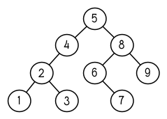
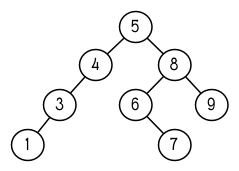

第四章：特殊数据结构
====================

在之前的章节里，我们讨论了列表，Lisp
最多功能的数据结构。本章将演示如何使用 Lisp
其它的数据结构：数组（包含向量与字符串），结构以及哈希表。它们或许不像列表这么灵活，但存取速度更快并使用了更少空间。

Common Lisp 还有另一种数据结构：实例（instance）。实例将在 11
章讨论，讲述 CLOS。

4.1 数组 (Array)
----------------

在 Common Lisp 里，你可以调用 `make-array`
来构造一个数组，第一个实参为一个指定数组维度的列表。要构造一个 `2 x 3`
的数组，我们可以：

    > (setf arr (make-array '(2 3) :initial-element nil))
    #<Simple-Array T (2 3) BFC4FE>

Common Lisp 的数组至少可以达到七个维度，每个维度至少可以容纳 1023
个元素。

`:initial-element`
实参是选择性的。如果有提供这个实参，整个数组会用这个值作为初始值。若试着取出未初始化的数组内的元素，其结果为未定义（undefined）。

用 `aref` 取出数组内的元素。与 Common Lisp 的存取函数一样， `aref`
是零索引的（zero-indexed）：

    > (aref arr 0 0)
    NIL

要替换数组的某个元素，我们使用 `setf` 与 `aref` ：

    > (setf (aref arr 0 0) 'b)
    B
    > (aref arr 0 0)
    B

要表示字面常量的数组（literal array），使用 `#na` 语法，其中 `n`
是数组的维度。举例来说，我们可以这样表示 `arr` 这个数组：

    #2a((b nil nil) (nil nil nil))

如果全局变量 `*print-array*` 为真，则数组会用以下形式来显示：

    > (setf *print-array* t)
    T
    > arr
    #2A((B NIL NIL) (NIL NIL NIL))

如果我们只想要一维的数组，你可以给 `make-array`
第一个实参传一个整数，而不是一个列表：

    > (setf vec (make-array 4 :initial-element nil))
    #(NIL NIL NIL NIL)

一维数组又称为向量（*vector*）。你可以通过调用 `vector`
来一步骤构造及填满向量，向量的元素可以是任何类型：

    > (vector "a" 'b 3)
    #("a" b 3)

字面常量的数组可以表示成 `#na` ，字面常量的向量也可以用这种语法表达。

可以用 `aref` 来存取向量，但有一个更快的函数叫做 `svref`
，专门用来存取向量。

    > (svref vec 0)
    NIL

在 `svref` 内的 “sv” 代表“简单向量”（“simple
vector”），所有的向量缺省是简单向量。 [^1]

4.2 示例：二叉搜索 (Example: Binary Search)
-------------------------------------------

作为一个示例，这小节演示如何写一个在排序好的向量里搜索对象的函数。如果我们知道一个向量是排序好的，我们可以比（65页）
`find` 做的更好， `find`
必须依序检查每一个元素。我们可以直接跳到向量中间开始找。如果中间的元素是我们要找的对象，搜索完毕。要不然我们持续往左半部或往右半部搜索，取决于对象是小于或大于中间的元素。

图 4.1 包含了一个这么工作的函数。其实这两个函数： `bin-search`
设置初始范围及发送控制信号给 `finder` ， `finder` 寻找向量 `vec` 内
`obj` 是否介于 `start` 及 `end` 之间。

    (defun bin-search (obj vec)
      (let ((len (length vec)))
        (and (not (zerop len))
             (finder obj vec 0 (- len 1)))))

    (defun finder (obj vec start end)
      (let ((range (- end start)))
        (if (zerop range)
            (if (eql obj (aref vec start))
                obj
                nil)
            (let ((mid (+ start (round (/ range 2)))))
              (let ((obj2 (aref vec mid)))
                (if (< obj obj2)
                    (finder obj vec start (- mid 1))
                    (if (> obj obj2)
                        (finder obj vec (+ mid 1) end)
                        obj)))))))

图 4.1: 搜索一个排序好的向量

如果要找的 `range` 缩小至一个元素，而如果这个元素是 `obj` 的话，则
`finder` 直接返回这个元素，反之返回 `nil` 。如果 `range` 大于 `1`
，我们設置 `middle` ( `round` 返回离实参最近的整数) 為 `obj2` 。如果
`obj` 小于 `obj2` ，则递归地往向量的左半部寻找。如果 `obj` 大于 `obj2`
，则递归地往向量的右半部寻找。剩下的一个选择是 `obj=obj2`
，在这个情况我们找到要找的元素，直接返回这个元素。

如果我们插入下面这行至 `finder` 的起始处：

    (format t "~A~%" (subseq vec start (+ end 1)))

我们可以观察被搜索的元素的数量，是每一步往左减半的：

    > (bin-search 3 #(0 1 2 3 4 5 6 7 8 9))
    #(0 1 2 3 4 5 6 7 8 9)
    #(0 1 2 3)
    #(3)
    3

4.3 字符与字符串 (Strings and Characters)
-----------------------------------------

字符串是字符组成的向量。我们用一系列由双引号包住的字符，来表示一个字符串常量，而字符
`c` 用 `#\c` 表示。

每个字符都有一个相关的整数 ── 通常是 ASCII 码，但不一定是。在多数的 Lisp
实现里，函数 `char-code` 返回与字符相关的数字，而 `code-char`
返回与数字相关的字符。

字符比较函数 `char<` （小于）， `char<=` （小于等于)， `char=` （等于)，
`char>=` （大于等于) ， `char>` （大于)，以及 `char/=`
（不同)。他们的工作方式和 146 页（译注 9.3 节)比较数字用的操作符一样。

    > (sort "elbow" #'char<)
    "below"

由于字符串是字符向量，序列与数组的函数都可以用在字符串。你可以用 `aref`
来取出元素，举例来说，

    > (aref "abc" 1)
    #\b

但针对字符串可以使用更快的 `char` 函数：

    > (char "abc" 1)
    #\b

可以使用 `setf` 搭配 `char` （或 `aref` ）来替换字符串的元素：

    > (let ((str (copy-seq "Merlin")))
       (setf (char str 3) #\k)
       str)

如果你想要比较两个字符串，你可以使用通用的 `equal`
函数，但还有一个比较函数，是忽略字母大小写的 `string-equal` ：

    > (equal "fred" "fred")
    T
    > (equal "fred" "Fred")
    NIL
    >(string-equal "fred" "Fred")
    T

Common Lisp 提供大量的操控、比较字符串的函数。收录在附录 D，从 364
页开始。

有许多方式可以创建字符串。最普遍的方式是使用 `format` 。将第一个参数设为
`nil` 来调用 `format` ，使它返回一个原本会印出来的字符串：

    > (format nil "~A or ~A" "truth" "dare")
    "truth or dare"

但若你只想把数个字符串连结起来，你可以使用 `concatenate`
，它接受一个特定类型的符号，加上一个或多个序列：

    > (concatenate 'string "not " "to worry")
    "not to worry"

4.4 序列 (Sequences)
--------------------

在 Common Lisp
里，序列类型包含了列表与向量（因此也包含了字符串）。有些用在列表的函数，实际上是序列函数，包括
`remove` 、 `length` 、 `subseq` 、 `reverse` 、 `sort` 、 `every` 以及
`some` 。所以 46 页（译注 3.11 小节的 `mirror?`
函数）我们所写的函数，也可以用在其他种类的序列上：

    > (mirror? "abba")
    T

我们已经看过四种用来取出序列元素的函数： 给列表使用的 `nth` ，
给向量使用的 `aref` 及 `svref` ，以及给字符串使用的 `char` 。 Common
Lisp 也提供了通用的 `elt` ，对任何种类的序列都有效：

    > (elt '(a b c) 1)
    B

针对特定类型的序列，特定的存取函数会比较快，所以使用 `elt`
是没有意义的，除非在代码当中，有需要支持通用序列的地方。

使用 `elt` ，我们可以写一个针对向量来说更有效率的 `mirror?` 版本：

    (defun mirror? (s)
      (let ((len (length s)))
        (and (evenp len)
             (do ((forward 0 (+ forward 1))
                  (back (- len 1) (- back 1)))
                 ((or (> forward back)
                      (not (eql (elt s forward)
                                (elt s back))))
                  (> forward back))))))

这个版本也可用在列表，但这个实现更适合给向量使用。频繁的对列表调用 `elt`
的代价是昂贵的，因为列表仅允许顺序存取。而向量允许随机存取，从任何元素来存取每一个元素都是廉价的。

许多序列函数接受一个或多个，由下表所列的标准关键字参数：

  参数         用途                    缺省值
  ------------ ----------------------- ------------
  :key         应用至每个元素的函数    identity
  :test        作来比较的函数          eql
  :from-end    若为真，反向工作。      nil
  :start       起始位置                0
  :end         若有给定，结束位置。    nil

一个接受所有关键字参数的函数是 `position`
，返回序列中一个元素的位置，未找到元素时则返回 `nil` 。我们使用
`position` 来演示关键字参数所扮演的角色。

    > (position #\a "fantasia")
    1
    > (position #\a "fantasia" :start 3 :end 5)
    4

第二个例子我们要找在第四个与第六个字符间，第一个 `a` 所出现的位置。
`:start` 关键字参数是第一个被考虑的元素位置，缺省是序列的第一个元素。
`:end` 关键字参数，如果有给的话，是第一个不被考虑的元素位置。

如果我们给入 `:from-end` 关键字参数，

    > (position #\a "fantasia" :from-end t)
    7

我们得到最靠近结尾的 `a`
的位置。但位置是像平常那样计算；而不是从尾端算回来的距离。

`:key`
关键字参数是序列中每个元素在被考虑之前，应用至元素上的函数。如果我们说，

    > (position 'a '((c d) (a b)) :key #'car)
    1

那么我们要找的是，元素的 `car` 部分是符号 `a` 的第一个元素。

`:test`
关键字参数接受需要两个实参的函数，并定义了怎样是一个成功的匹配。缺省函数为
`eql` 。如果你想要匹配一个列表，你也许想使用 `equal` 来取代：

    > (position '(a b) '((a b) (c d)))
    NIL
    > (position '(a b) '((a b) (c d)) :test #'equal)
    0

`:test` 关键字参数可以是任何接受两个实参的函数。举例来说，给定 `<`
，我们可以询问第一个使第一个参数比它小的元素位置：

    > (position 3 '(1 0 7 5) :test #'<)
    2

使用 `subseq` 与 `position`
，我们可以写出分开序列的函数。举例来说，这个函数

    (defun second-word (str)
      (let ((p1 (+ (position #\  str) 1)))
        (subseq str p1 (position #\  str :start p1))))

返回字符串中第一个单字空格后的第二个单字：

    > (second-word "Form follows function")
    "follows"

要找到满足谓词的元素，其中谓词接受一个实参，我们使用 `position-if`
。它接受一个函数与序列，并返回第一个满足此函数的元素：

    > (position-if #'oddp '(2 3 4 5))
    1

`position-if` 接受除了 `:test` 之外的所有关键字参数。

有许多相似的函数，如给序列使用的 `member` 与 `member-if` 。分别是，
`find` （接受全部关键字参数）与 `find-if` （接受除了 `:test`
之外的所有关键字参数）：

    > (find #\a "cat")
    #\a

    > (find-if #'characterp "ham")
    #\h

不同于 `member` 与 `member-if` ，它们仅返回要寻找的对象。

通常一个 `find-if` 的调用，如果解读为 `find` 搭配一个 `:key`
关键字参数的话，会显得更清楚。举例来说，表达式

    (find-if #'(lambda (x)
                 (eql (car x) 'complete))
             lst)

可以更好的解读为

    (find 'complete lst :key #'car)

函数 `remove` （22 页）以及 `remove-if` 通常都可以用在序列。它们跟
`find` 与 `find-if` 是一样的关系。另一个相关的函数是 `remove-duplicates`
，仅保留序列中每个元素的最后一次出现。

    > (remove-duplicates "abracadabra")
    "cdbra"

这个函数接受前表所列的所有关键字参数。

函数 `reduce`
用来把序列压缩成一个值。它至少接受两个参数，一个函数与序列。函数必须是接受两个实参的函数。在最简单的情况下，一开始函数用序列前两个元素作为实参来调用，之后接续的元素作为下次调用的第二个实参，而上次返回的值作为下次调用的第一个实参。最后调用最终返回的值作为
`reduce` 整个函数的返回值。也就是说像是这样的表达式：

    (reduce #'fn '(a b c d))

等同于

    (fn (fn (fn 'a 'b) 'c) 'd)

我们可以使用 `reduce`
来扩充只接受两个参数的函数。举例来说，要得到三个或多个列表的交集(intersection)，我们可以：

    > (reduce #'intersection '((b r a d 's) (b a d) (c a t)))
    (A)

4.5 示例：解析日期 (Example: Parsing Dates)
-------------------------------------------

作为序列操作的示例，本节演示了如何写程序来解析日期。我们将编写一个程序，可以接受像是
“16 Aug 1980” 的字符串，然后返回一个表示日、月、年的整数列表。

    (defun tokens (str test start)
      (let ((p1 (position-if test str :start start)))
        (if p1
            (let ((p2 (position-if #'(lambda (c)
                                       (not (funcall test c)))
                                   str :start p1)))
              (cons (subseq str p1 p2)
                    (if p2
                        (tokens str test p2)
                        nil)))
            nil)))

    (defun constituent (c)
      (and (graphic-char-p c)
           (not (char= c #\ ))))

图 4.2 辨别符号 (token)

图 4.2 里包含了某些在这个应用里所需的通用解析函数。第一个函数 `tokens`
，用来从字符串中取出语元
（token）。给定一个字符串及测试函数，满足测试函数的字符组成子字符串，子字符串再组成列表返回。举例来说，如果测试函数是对字母返回真的
`alpha-char-p` 函数，我们得到：

    > (tokens "ab12 3cde.f" #'alpha-char-p 0)
    ("ab" "cde" "f")

所有不满足此函数的字符被视为空白 ──
他们是语元的分隔符，但永远不是语元的一部分。

函数 `constituent` 被定义成用来作为 `tokens` 的实参。

在 Common Lisp
里，*图形字符*是我们可见的字符，加上空白字符。所以如果我们用
`constituent` 作为测试函数时，

    > (tokens "ab12 3cde.f gh" #'constituent 0)
    ("ab12" "3cde.f" "gh")

则语元将会由空白区分出来。

图 4.3 包含了特别为解析日期打造的函数。函数 `parse-date`
接受一个特别形式组成的日期，并返回代表这个日期的整数列表：

    > (parse-date "16 Aug 1980")
    (16 8 1980)

    (defun parse-date (str)
      (let ((toks (tokens str #'constituent 0)))
        (list (parse-integer (first toks))
              (parse-month (second toks))
              (parse-integer (third toks)))))

    (defconstant month-names
      #("jan" "feb" "mar" "apr" "may" "jun"
        "jul" "aug" "sep" "oct" "nov" "dec"))

    (defun parse-month (str)
      (let ((p (position str month-names
                             :test #'string-equal)))
        (if p
            (+ p 1)
            nil)))

图 4.3 解析日期的函数

`parse-date` 使用 `tokens` 来解析日期字符串，接着调用 `parse-month` 及
`parse-integer` 来转译年、月、日。要找到月份，调用 `parse-month`
，由于使用的是 `string-equal`
来匹配月份的名字，所以输入可以不分大小写。要找到年和日，调用内置的
`parse-integer` ， `parse-integer` 接受一个字符串并返回对应的整数。

如果需要自己写程序来解析整数，也许可以这么写：

    (defun read-integer (str)
      (if (every #'digit-char-p str)
          (let ((accum 0))
            (dotimes (pos (length str))
              (setf accum (+ (* accum 10)
                             (digit-char-p (char str pos)))))
            accum)
        nil))

这个定义演示了在 Common Lisp 中，字符是如何转成数字的 ── 函数
`digit-char-p` 不仅测试字符是否为数字，同时返回了对应的整数。

4.6 结构 (Structures)
---------------------

结构可以想成是豪华版的向量。假设你要写一个程序来追踪长方体。你可能会想用三个向量元素来表示长方体：高度、宽度及深度。与其使用原本的
`svref` ，不如定义像是下面这样的抽象，程序会变得更容易阅读，

    (defun block-height (b) (svref b 0))

而结构可以想成是，这些函数通通都替你定义好了的向量。

要想定义结构，使用 `defstruct`
。在最简单的情况下，只要给出结构及字段的名字便可以了：

    (defstruct point
      x
      y)

这里定义了一个 `point` 结构，具有两个字段 `x` 与 `y` 。同时隐式地定义了
`make-point` 、 `point-p` 、 `copy-point` 、 `point-x` 及 `point-y`
函数。

2.3 节提过， Lisp 程序可以写出 Lisp
程序。这是目前所见的明显例子之一。当你调用 `defstruct`
时，它自动生成了其它几个函数的定义。有了宏以后，你将可以自己来办到同样的事情（如果需要的话，你甚至可以自己写出
`defstruct` ）。

每一个 `make-point` 的调用，会返回一个新的 `point`
。可以通过给予对应的关键字参数，来指定单一字段的值：

    (setf p (make-point :x 0 :y 0))
    #S(POINT X 0 Y 0)

存取 `point` 字段的函数不仅被定义成可取出数值，也可以搭配 `setf`
一起使用。

    > (point-x p)
    0
    > (setf (point-y p) 2)
    2
    > p
    #S(POINT X 0 Y 2)

定义结构也定义了以结构为名的类型。每个点的类型层级会是，类型 `point`
，接着是类型 `structure` ，再来是类型 `atom` ，最后是 `t` 类型。所以使用
`point-p` 来测试某个东西是不是一个点时，也可以使用通用性的函数，像是
`typep` 来测试。

    > (point-p p)
    T
    > (typep p 'point)
    T

我们可以在本来的定义中，附上一个列表，含有字段名及缺省表达式，来指定结构字段的缺省值。

    (defstruct polemic
      (type (progn
              (format t "What kind of polemic was it? ")
              (read)))
      (effect nil))

如果 `make-polemic`
调用没有给字段指定初始值，则字段会被设成缺省表达式的值：

    > (make-polemic)
    What kind of polemic was it? scathing
    #S(POLEMIC :TYPE SCATHING :EFFECT NIL)

结构显示的方式也可以控制，以及结构自动产生的存取函数的字首。以下是做了前述两件事的
`point` 定义：

    (defstruct (point (:conc-name p)
                      (:print-function print-point))
      (x 0)
      (y 0))

    (defun print-point (p stream depth)
      (format stream "#<~A, ~A>" (px p) (py p)))

`:conc-name`
关键字参数指定了要放在字段前面的名字，并用这个名字来生成存取函数。预设是
`point-` ；现在变成只有 `p`
。不使用缺省的方式使代码的可读性些微降低了，只有在需要常常用到这些存取函数时，你才会想取个短点的名字。

`:print-function` 是在需要显示结构出来看时，指定用来打印结构的函数 ──
需要显示的情况比如，要在顶层显示时。这个函数需要接受三个实参：要被印出的结构，在哪里被印出，第三个参数通常可以忽略。
[^2] 我们会在 7.1
节讨论流（stream）。现在来说，只要知道流可以作为参数传给 `format`
就好了。

函数 `print-point` 会用缩写的形式来显示点：

    > (make-point)
    #<0,0>

4.7 示例：二叉搜索树 (Example: Binary Search Tree)
--------------------------------------------------

由于 `sort` 本身系统就有了，极少需要在 Common Lisp
里编写排序程序。本节将演示如何解决一个与此相关的问题，这个问题尚未有现成的解决方案：维护一个已排序的对象集合。本节的代码会把对象存在二叉搜索树里（
*binary search tree* ）或称作
BST。当二叉搜索树平衡时，允许我们可以在与时间成 `log n`
比例的时间内，来寻找、添加或是删除元素，其中 `n` 是集合的大小。

图 4.4: 二叉搜索树

二叉搜索树是一种二叉树，给定某个排序函数，比如 `<` ，每个元素的左子树都
`<` 该元素，而该元素 `<` 其右子树。图 4.4 展示了根据 `<` 排序的二叉树。

图 4.5 包含了二叉搜索树的插入与寻找的函数。基本的数据结构会是 `node`
（节点），节点有三个部分：一个字段表示存在该节点的对象，以及各一个字段表示节点的左子树及右子树。可以把节点想成是有一个
`car` 和两个 `cdr` 的一个 cons 核（cons cell）。

    (defstruct (node (:print-function
                      (lambda (n s d)
                        (format s "#<~A>" (node-elt n)))))
      elt (l nil) (r nil))

    (defun bst-insert (obj bst <)
      (if (null bst)
          (make-node :elt obj)
          (let ((elt (node-elt bst)))
            (if (eql obj elt)
                bst
                (if (funcall < obj elt)
                    (make-node
                       :elt elt
                       :l (bst-insert obj (node-l bst) <)
                       :r (node-r bst))
                    (make-node
                       :elt elt
                       :r (bst-insert obj (node-r bst) <)
                       :l (node-l bst)))))))

    (defun bst-find (obj bst <)
      (if (null bst)
          nil
          (let ((elt (node-elt bst)))
            (if (eql obj elt)
                bst
                (if (funcall < obj elt)
                    (bst-find obj (node-l bst) <)
                    (bst-find obj (node-r bst) <))))))

    (defun bst-min (bst)
      (and bst
           (or (bst-min (node-l bst)) bst)))

    (defun bst-max (bst)
      (and bst
           (or (bst-max (node-r bst)) bst)))

图 4.5 二叉搜索树：查询与插入

一棵二叉搜索树可以是 `nil`
或是一个左子、右子树都是二叉搜索树的节点。如同列表可由连续调用 `cons`
来构造，二叉搜索树将可以通过连续调用 `bst-insert`
来构造。这个函数接受一个对象，一棵二叉搜索树及一个排序函数，并返回将对象插入的二叉搜索树。和
`cons` 函数一样， `bst-insert`
不改动做为第二个实参所传入的二叉搜索树。以下是如何使用这个函数来构造一棵叉搜索树：

    > (setf nums nil)
    NIL
    > (dolist (x '(5 8 4 2 1 9 6 7 3))
        (setf nums (bst-insert x nums #'<)))
    NIL

图 4.4 显示了此时 `nums` 的结构所对应的树。

我们可以使用 `bst-find` 来找到二叉搜索树中的对象，它与 `bst-insert`
接受同样的参数。先前叙述所提到的 `node` 结构，它像是一个具有两个 `cdr`
的 cons 核。如果我们把 16 页的 `our-member` 拿来与 `bst-find`
比较的话，这样的类比更加明确。

与 `member` 相同， `bst-find`
不仅返回要寻找的元素，也返回了用寻找元素做为根节点的子树：

    > (bst-find 12 nums #'<)
    NIL
    > (bst-find 4 nums #'<)
    #<4>

这使我们可以区分出无法找到某个值，以及成功找到 `nil` 的情况。

要找到二叉搜索树的最小及最大的元素是很简单的。要找到最小的，我们沿着左子树的路径走，如同
`bst-min` 所做的。要找到最大的，沿着右子树的路径走，如同 `bst-max`
所做的：

    > (bst-min nums)
    #<1>
    > (bst-max nums)
    #<9>

要从二叉搜索树里移除元素一样很快，但需要更多代码。图 4.6
演示了如何从二叉搜索树里移除元素。

    (defun bst-remove (obj bst <)
      (if (null bst)
          nil
          (let ((elt (node-elt bst)))
            (if (eql obj elt)
                (percolate bst)
                (if (funcall < obj elt)
                    (make-node
                       :elt elt
                       :l (bst-remove obj (node-l bst) <)
                       :r (node-r bst))
                    (make-node
                       :elt elt
                       :r (bst-remove obj (node-r bst) <)
                       :l (node-l bst)))))))

    (defun percolate (bst)
      (cond ((null (node-l bst))
             (if (null (node-r bst))
                 nil
                 (rperc bst)))
            ((null (node-r bst)) (lperc bst))
            (t (if (zerop (random 2))
                   (lperc bst)
                   (rperc bst)))))

    (defun rperc (bst)
      (make-node :elt (node-elt (node-r bst))
                 :l (node-l bst)
                 :r (percolate (node-r bst))))

图 4.6 二叉搜索树：移除

**勘误:** 此版 `bst-remove` 的定义已被汇报是坏掉的，请参考
[这里](https://gist.github.com/2868263) 获得修复版。

函数 `bst-remove`
接受一个对象，一棵二叉搜索树以及排序函数，并返回一棵与本来的二叉搜索树相同的树，但不包含那个要移除的对象。和
`remove` 一样，它不改动做为第二个实参所传入的二叉搜索树：

    > (setf nums (bst-remove 2 nums #'<))
    #<5>
    > (bst-find 2 nums #'<)
    NIL

此时 `nums` 的结构应该如图 4.7 所示。 （另一个可能性是 `1` 取代了 `2`
的位置。）

图 4.7: 二叉搜索树

移除需要做更多工作，因为从内部节点移除一个对象时，会留下一个空缺，需要由其中一个孩子来填补。这是
`percolate` 函数的用途。当它替换一个二叉搜索树的树根（topmost
element）时，会找其中一个孩子来替换，并用此孩子的孩子来填补，如此这般一直递归下去。

为了要保持树的平衡，如果有两个孩子时， `perlocate` 随机择一替换。表达式
`(random 2)` 会返回 `0` 或 `1` ，所以 `(zerop (random 2))`
会返回真或假。

    (defun bst-traverse (fn bst)
      (when bst
        (bst-traverse fn (node-l bst))
        (funcall fn (node-elt bst))
        (bst-traverse fn (node-r bst))))

图 4.8 二叉搜索树：遍历

一旦我们把一个对象集合插入至二叉搜索树时，中序遍历会将它们由小至大排序。这是图
4.8 中， `bst-traverse` 函数的用途：

    > (bst-traverse #'princ nums)
    13456789
    NIL

（函数 `princ` 仅显示单一对象）

本节所给出的代码，提供了一个二叉搜索树实现的脚手架。你可能想根据应用需求，来充实这个脚手架。举例来说，这里所给出的代码每个节点只有一个
`elt` 字段；在许多应用里，有两个字段会更有意义， `key` 与 `value`
。本章的这个版本把二叉搜索树视为集合看待，从这个角度看，重复的插入是被忽略的。但是代码可以很简单地改动，来处理重复的元素。

二叉搜索树不仅是维护一个已排序对象的集合的方法。他们是否是最好的方法，取决于你的应用。一般来说，二叉搜索树最适合用在插入与删除是均匀分布的情况。有一件二叉搜索树不擅长的事，就是用来维护优先队列（priority
queues）。在一个优先队列里，插入也许是均匀分布的，但移除总是在一个另一端。这会导致一个二叉搜索树变得不平衡，而我们期望的复杂度是
`O(log(n))` 插入与移除操作，将会变成 `O(n)`
。如果用二叉搜索树来表示一个优先队列，也可以使用一般的列表，因为二叉搜索树最终会作用的像是个列表。

4.8 哈希表 (Hash Table)
-----------------------

第三章演示过列表可以用来表示集合（sets）与映射（mappings）。但当列表的长度大幅上升时（或是
10 个元素），使用哈希表的速度比较快。你通过调用 `make-hash-table`
来构造一个哈希表，它不需要传入参数：

    > (setf ht (make-hash-table))
    #<Hash-Table BF0A96>

和函数一样，哈希表总是用 `#<...>` 的形式来显示。

一个哈希表，与一个关联列表类似，是一种表达对应关系的方式。要取出与给定键值有关的数值，我们调用
`gethash`
并传入一个键值与哈希表。预设情况下，如果没有与这个键值相关的数值，
`gethash` 会返回 `nil` 。

    > (gethash 'color ht)
    NIL
    NIL

在这里我们首次看到 Common Lisp
最突出的特色之一：一个表达式竟然可以返回多个数值。函数 `gethash`
返回两个数值。第一个值是与键值有关的数值，第二个值说明了哈希表是否含有任何用此键值来储存的数值。由于第二个值是
`nil` ，我们知道第一个 `nil` 是缺省的返回值，而不是因为 `nil` 是与
`color` 有关的数值。

大部分的实现会在顶层显示一个函数调用的所有返回值，但仅期待一个返回值的代码，只会收到第一个返回值。
5.5 节会说明，代码如何接收多个返回值。

要把数值与键值作关联，使用 `gethash` 搭配 `setf` ：

    > (setf (gethash 'color ht) 'red)
    RED

现在如果我们再次调用 `gethash` ，我们会得到我们刚插入的值：

    > (gethash 'color ht)
    RED
    T

第二个返回值证明，我们取得了一个真正储存的对象，而不是预设值。

存在哈希表的对象或键值可以是任何类型。举例来说，如果我们要保留函数的某种讯息，我们可以使用哈希表，用函数作为键值，字符串作为词条（entry）：

    > (setf bugs (make-hash-table))
    #<Hash-Table BF4C36>
    > (push "Doesn't take keyword arguments."
            (gethash #'our-member bugs))
    ("Doesn't take keyword arguments.")

由于 `gethash` 缺省返回 `nil` ，而 `push` 是 `setf`
的缩写，可以轻松的给哈希表新添一个词条。 （有困扰的 `our-member` 定义在
16 页。）

可以用哈希表来取代用列表表示集合。当集合变大时，哈希表的查询与移除会来得比较快。要新增一个成员到用哈希表所表示的集合，把
`gethash` 用 `setf` 设成 `t` ：

    > (setf fruit (make-hash-table))
    #<Hash-Table BFDE76>
    > (setf (gethash 'apricot fruit) t)
    T

然后要测试是否为成员，你只要调用：

    > (gethash 'apricot fruit)
    T
    T

由于 `gethash` 缺省返回真，一个新创的哈希表，会很方便地是一个空集合。

要从集合中移除一个对象，你可以调用 `remhash`
，它从一个哈希表中移除一个词条：

    > (remhash 'apricot fruit)
    T

返回值说明了是否有词条被移除；在这个情况里，有。

哈希表有一个迭代函数： `maphash`
，它接受两个实参，接受两个参数的函数以及哈希表。该函数会被每个键值对调用，没有特定的顺序：

    > (setf (gethash 'shape ht) 'spherical
            (gethash 'size ht) 'giant)
    GIANT

    > (maphash #'(lambda (k v)
                   (format t "~A = ~A~%" k v))
               ht)
    SHAPE = SPHERICAL
    SIZE = GIANT
    COLOR = RED
    NIL

`maphash` 总是返回 `nil`
，但你可以通过传入一个会累积数值的函数，把哈希表的词条存在列表里。

哈希表可以容纳任何数量的元素，但当哈希表空间用完时，它们会被扩张。如果你想要确保一个哈希表，从特定数量的元素空间大小开始时，可以给
`make-hash-table` 一个选择性的 `:size`
关键字参数。做这件事情有两个理由：因为你知道哈希表会变得很大，你想要避免扩张它；或是因为你知道哈希表会是很小，你不想要浪费内存。
`:size`
参数不仅指定了哈希表的空间，也指定了元素的数量。平均来说，在被扩张前所能够容纳的数量。所以

`(make-hash-table :size 5)`

会返回一个预期存放五个元素的哈希表。

和任何牵涉到查询的结构一样，哈希表一定有某种比较键值的概念。预设是使用
`eql` ，但你可以提供一个额外的关键字参数 `:test` 来告诉哈希表要使用 `eq`
， `equal` ，还是 `equalp` ：

    > (setf writers (make-hash-table :test #'equal))
    #<Hash-Table C005E6>
    > (setf (gethash '(ralph waldo emerson) writers) t)
    T

这是一个让哈希表变得有效率的取舍之一。有了列表，我们可以指定 `member`
为判断相等性的谓词。有了哈希表，我们可以预先决定，并在哈希表构造时指定它。

大多数 Lisp
编程的取舍（或是生活，就此而论）都有这种特质。起初你想要事情进行得流畅，甚至赔上效率的代价。之后当代码变得沉重时，你牺牲了弹性来换取速度。

Chapter 4 总结 (Summary)
------------------------

1.  Common Lisp 支持至少 7 个维度的数组。一维数组称为向量。
2.  字符串是字符的向量。字符本身就是对象。
3.  序列包括了向量与列表。许多序列函数都接受标准的关键字参数。
4.  处理字符串的函数非常多，所以用 Lisp 来解析字符串是小菜一碟。
5.  调用 `defstruct`
    定义了一个带有命名字段的结构。它是一个程序能写出程序的好例子。
6.  二叉搜索树见长于维护一个已排序的对象集合。
7.  哈希表提供了一个更有效率的方式来表示集合与映射 (mappings)。

Chapter 4 习题 (Exercises)
--------------------------

1.  定义一个函数，接受一个平方数组（square array，一个相同维度的数组
    `(n n)` )，并将它顺时针转 90 度。

<!-- -->

    > (quarter-turn #2A((a b) (c d)))
    #2A((C A) (D B))

你会需要用到 361 页的 `array-dimensions` 。

2.  阅读 368 页的 `reduce` 说明，然后用它来定义：

<!-- -->

    (a) copy-list
    (b) reverse（针对列表）

3.  定义一个结构来表示一棵树，其中每个节点包含某些数据及三个小孩。定义：

<!-- -->

    (a) 一个函数来复制这样的树（复制完的节点与本来的节点是不相等（ `eql` ）的）
    (b) 一个函数，接受一个对象与这样的树，如果对象与树中各节点的其中一个字段相等时，返回真。

4.  定义一个函数，接受一棵二叉搜索树，并返回由此树元素所组成的，一个由大至小排序的列表。
5.  定义 `bst-adjoin` 。这个函数应与 `bst-insert`
    接受相同的参数，但应该只在对象不等于任何树中对象时将其插入。

**勘误:** `bst-adjoin` 的功能与 `bst-insert` 一模一样。

6.  任何哈希表的内容可以由关联列表（assoc-list）来描述，其中列表的元素是
    `(k . v)` 的形式，对应到哈希表中的每一个键值对。定义一个函数：

<!-- -->

    (a) 接受一个关联列表，并返回一个对应的哈希表。
    (b) 接受一个哈希表，并返回一个对应的关联列表。

**脚注**

[^1]: 一个简单数组大小是不可调整、元素也不可替换的，并不含有填充指针（fill-pointer）。数组缺省是简单的。简单向量是个一维的简单数组，可以含有任何类型的元素。

[^2]: 在 ANSI Common Lisp 里，你可以给一个 `:print-object`
    的关键字参数来取代，它只需要两个实参。也有一個宏叫做
    `print-unreadable-object` ，能用则用，可以用 `#<...>`
    的语法来显示对象。
