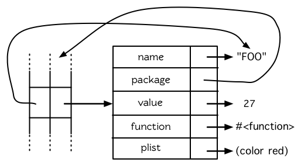

第八章：符号
============

我们一直在使用符号。符号，在看似简单的表面之下，又好像没有那么简单。起初最好不要纠结于背后的实现机制。可以把符号当成数据对象与名字那样使用，而不需要理解两者是如何关联起来的。但到了某个时间点，停下来思考背后是究竟是如何工作会是很有用的。本章解释了背后实现的细节。

8.1 符号名 (Symbol Names)
-------------------------

第二章描述过，符号是变量的名字，符号本身以对象所存在。但 Lisp
符号的可能性，要比在多数语言仅允许作为变量名来得广泛许多。实际上，符号可以用任何字符串当作名字。可以通过调用
`symbol-name` 来获得符号的名字：

    > (symbol-name 'abc)
    "ABC"

注意到这个符号的名字，打印出来都是大写字母。缺省情况下， Common Lisp
在读入时，会把符号名字所有的英文字母都转成大写。代表 Common Lisp
缺省是不分大小写的：

    > (eql 'abc 'Abc)
    T
    > (CaR '(a b c))
    A

一个名字包含空白，或其它可能被读取器认为是重要的字符的符号，要用特殊的语法来引用。任何存在垂直杠
(vertical
bar)之间的字符序列将被视为符号。可以如下这般在符号的名字中，放入任何字符：

    > (list '|Lisp 1.5| '|| '|abc| '|ABC|)
    (|Lisp 1.5| || |abc| ABC)

当这种符号被读入时，不会有大小写转换，而宏字符与其他的字符被视为一般字符。

那什么样的符号不需要使用垂直杠来参照呢？基本上任何不是数字，或不包含读取器视为重要的字符的符号。一个快速找出你是否可以不用垂直杠来引用符号的方法，是看看
Lisp 如何印出它的。如果 Lisp
没有用垂直杠表示一个符号，如上述列表的最后一个，那么你也可以不用垂直杠。

记得，垂直杠是一种表示符号的特殊语法。它们不是符号的名字之一：

    > (symbol-name '|a b c|)
    "a b c"

(如果想要在符号名称内使用垂直杠，可以放一个反斜线在垂直杠的前面。)

译注: 反斜线是 `\` (backslash)。

8.2 属性列表 (Property Lists)
-----------------------------

在 Common Lisp 里，每个符号都有一个属性列表（property-list）或称为
`plist` 。函数 `get`
接受符号及任何类型的键值，然后返回在符号的属性列表中，与键值相关的数值：

    > (get 'alizarin 'color)
    NIL

它使用 `eql` 来比较各个键。若某个特定的属性没有找到时， `get` 返回 `nil`
。

要将值与键关联起来时，你可以使用 `setf` 及 `get` :

    > (setf (get 'alizarin 'color) 'red)
    RED
    > (get 'alizarin 'color)
    RED

现在符号 `alizarin` 的 `color` 属性是 `red` 。

**图 8.1 符号的结构**

    > (setf (get 'alizarin 'transparency) 'high)
    HIGH
    > (symbol-plist 'alizarin)
    (TRANSPARENCY HIGH COLOR RED)

注意，属性列表不以关联列表（assoc-lists）的形式表示，虽然用起来感觉是一样的。

在 Common Lisp 里，属性列表用得不多。他们大部分被哈希表取代了（4.8
小节）。

8.3 符号很不简单 (Symbols Are Big)
----------------------------------

当我们输入名字时，符号就被悄悄地创建出来了，而当它们被显示时，我们只看的到符号的名字。某些情况下，把符号想成是表面所见的东西就好，别想太多。但有时候符号不像看起来那么简单。

从我们如何使用和检查符号的方式来看，符号像是整数那样的小对象。而符号实际上确实是一个对象，差不多像是由
`defstruct` 定义的那种结构。符号可以有名字、 主包（home
package）、作为变量的值、作为函数的值以及带有一个属性列表。图 8.1
演示了符号在内部是如何表示的。

很少有程序会使用很多符号，以致于值得用其它的东西来代替符号以节省空间。但需要记住的是，符号是实际的对象，不仅是名字而已。当两个变量设成相同的符号时，与两个变量设成相同列表一样：两个变量的指针都指向同样的对象。

8.4 创建符号 (Creating Symbols)
-------------------------------

8.1
节演示了如何取得符号的名字。另一方面，用字符串生成符号也是有可能的。但比较复杂一点，因为我们需要先介绍包（package）。

概念上来说，包是将名字映射到符号的符号表（symbol-tables）。每个普通的符号都属于一个特定的包。符号属于某个包，我们称为符号被包扣押（intern）了。函数与变量用符号作为名称。包借由限制哪个符号可以访问来实现模块化（modularity），也是因为这样，我们才可以引用到函数与变量。

大多数的符号在读取时就被扣押了。在第一次输入一个新符号的名字时，Lisp
会产生一个新的符号对象，并将它扣押到当下的包里（缺省是
`common-lisp-user` 包)。但也可以通过给入字符串与选择性包参数给 `intern`
函数，来扣押一个名称为字符串名的符号:

    > (intern "RANDOM-SYMBOL")
    RANDOM-SYMBOL
    NIL

选择性包参数缺省是当前的包，所以前述的表达式，返回当前包里的一个符号，此符号的名字是
“RANDOM-SYMBOL”，若此符号尚未存在时，会创建一个这样的符号出来。第二个返回值告诉我们符号是否存在；在这个情况，它不存在。

不是所有的符号都会被扣押。有时候有一个自由的（uninterned）符号是有用的，这和公用电话本是一样的原因。自由的符号叫做
*gensyms* 。我们将会在第 10 章讨论宏（Macro）时，理解 `gensym` 的作用。

8.5 多重包 (Multiple Packages)
------------------------------

大的程序通常切分为多个包。如果程序的每个部分都是一个包，那么开发程序另一个部分的某个人，将可以使用符号来作为函数名或变量名，而不必担心名字在别的地方已经被用过了。

在没有提供定义多个命名空间的语言里，工作于大项目的程序员，通常需要想出某些规范（convention），来确保他们不会使用同样的名称。举例来说，程序员写显示相关的代码（display
code）可能用 `disp_` 开头的名字，而写数学相关的代码（math
code）的程序员仅使用由 `math_`
开始的代码。所以若是数学相关的代码里，包含一个做快速傅立叶转换的函数时，可能会叫做
`math_fft` 。

包不过是提供了一种便捷方式来自动办到此事。如果你将函数定义在单独的包里，可以随意使用你喜欢的名字。只有你明确导出（
`export` ）的符号会被别的包看到，而通常前面会有包的名字(或修饰符)。

举例来说，假设一个程序分为两个包， `math` 与 `disp` 。如果符号 `fft` 被
`math` 包导出，则 `disp` 包里可以用 `math:fft` 来参照它。在 `math`
包里，可以只用 `fft` 来参照。

下面是你可能会放在文件最上方，包含独立包的代码：

    (defpackage "MY-APPLICATION"
                (:use "COMMON-LISP" "MY-UTILITIES")
                (:nicknames "APP")
                (:export "WIN" "LOSE" "DRAW"))

    (in-package my-application)

`defpackage` 定义一个新的包叫做 `my-application` [^1]
它使用了其他两个包， `common-lisp` 与 `my-utilities`
，这代表着可以不需要用包修饰符（package
qualifiers）来存取这些包所导出的符号。许多包都使用了 `common-lisp` 包 ──
因为你不会想给 Lisp 自带的操作符与变量再加上修饰符。

`my-application` 包本身只输出三个符号: `WIN` 、 `LOSE` 以及 `DRAW`
。由于调用 `defpackage` 给了 `my-application` 一个匿称 `app`
，则别的包可以这样引用到这些符号，比如 `app:win` 。

`defpackage` 伴随着一个 `in-package` ，确保当前包是 `my-application`
。所有其它未修饰的符号会被扣押至 `my-application` ── 除非之后有别的
`in-package`
出现。当一个文件被载入时，当前的包总是被重置成载入之前的值。

8.6 关键字 (Keywords)
---------------------

在 `keyword` 包的符号
(称为关键字)有两个独特的性质：它们总是对自己求值，以及可以在任何地方引用它们，如
`:x` 而不是 `keyword:x` 。我们首次在 44 页 (译注: 3.10
小节）介绍关键字参数时， `(member '(a) '((a) (z)) test: #'equal)` 比
`(member '(a) '((a) (z)) :test #'equal)`
读起来更自然。现在我们知道为什么第二个较别扭的形式才是对的。 `test`
前的冒号字首，是关键字的识别符。

为什么使用关键字而不用一般的符号？因为关键字在哪都可以存取。一个函数接受符号作为实参，应该要写成预期关键字的函数。举例来说，这个函数可以安全地在任何包里调用:

    (defun noise (animal)
      (case animal
        (:dog :woof)
        (:cat :meow)
        (:pig :oink)))

但如果是用一般符号写成的话，它只在被定义的包内正常工作，除非关键字也被导出了。

8.7 符号与变量 (Symbols and Variables)
--------------------------------------

Lisp
有一件可能会使你困惑的事情是，符号与变量的从两个非常不同的层面互相关联。当符号是特别变量（special
variable）的名字时，变量的值存在符号的 value 栏位（图 8.1）。
`symbol-value`
函数引用到那个栏位，所以在符号与特殊变量的值之间，有直接的连接关系。

而对于词法变量（lexical
variables）来说，事情就完全不一样了。一个作为词法变量的符号只不过是个占位符（placeholder）。编译器会将其转为一个寄存器（register）或内存位置的引用位址。在最后编译出来的代码中，我们无法追踪这个符号
(除非它被保存在调试器「debugger」的某个地方)。因此符号与词法变量的值之间是没有连接的；只要一有值，符号就消失了。

8.8 示例：随机文本 (Example: Random Text)
-----------------------------------------

如果你要写一个操作单词的程序，通常使用符号会比字符串来得好，因为符号概念上是原子性的（atomic）。符号可以用
`eql` 一步比较完成，而字符串需要使用 `string=` 或 `string-equal`
逐一字符做比较。作为一个示例，本节将演示如何写一个程序来产生随机文本。程序的第一部分会读入一个示例文件（越大越好），用来累积之后所给入的相关单词的可能性（likeilhood）的信息。第二部分在每一个单词都根据原本的示例，产生一个随机的权重（weight）之后，随机走访根据第一部分所产生的网络。

产生的文字将会是部分可信的（locally
plausible），因为任两个出现的单词也是输入文件里，两个同时出现的单词。令人惊讶的是，获得看起来是
── 有意义的整句 ── 甚至整个段落是的频率相当高。

图 8.2 包含了程序的上半部，用来读取示例文件的代码。

    (defparameter *words* (make-hash-table :size 10000))

    (defconstant maxword 100)

    (defun read-text (pathname)
      (with-open-file (s pathname :direction :input)
        (let ((buffer (make-string maxword))
              (pos 0))
          (do ((c (read-char s nil :eof)
                  (read-char s nil :eof)))
              ((eql c :eof))
            (if (or (alpha-char-p c) (char= c #\'))
                (progn
                  (setf (aref buffer pos) c)
                  (incf pos))
                (progn
                  (unless (zerop pos)
                    (see (intern (string-downcase
                                   (subseq buffer 0 pos))))
                    (setf pos 0))
                  (let ((p (punc c)))
                    (if p (see p)))))))))

    (defun punc (c)
      (case c
        (#\. '|.|) (#\, '|,|) (#\; '|;|)
        (#\! '|!|) (#\? '|?|) ))

    (let ((prev `|.|))
      (defun see (symb)
        (let ((pair (assoc symb (gethash prev *words*))))
          (if (null pair)
              (push (cons symb 1) (gethash prev *words*))
              (incf (cdr pair))))
        (setf prev symb)))

**图 8.2 读取示例文件**

从图 8.2 所导出的数据，会被存在哈希表 `*words*`
里。这个哈希表的键是代表单词的符号，而值会像是下列的关联列表（assoc-lists）:

    ((|sin| . 1) (|wide| . 2) (|sights| . 1))

使用[弥尔顿的失乐园](http://zh.wikipedia.org/wiki/%E5%A4%B1%E6%A8%82%E5%9C%92)作为示例文件时，这是与键
`|discover|` 有关的值。它指出了 “discover”
这个单词，在诗里面用了四次，与 “wide” 用了两次，而 “sin” 与 ”sights”
各一次。(译注: 诗可以在这里找到 <http://www.paradiselost.org/> )

函数 `read-text`
累积了这个信息。这个函数接受一个路径名（pathname），然后替每一个出现在文件中的单词，生成一个上面所展示的关联列表。它的工作方式是，逐字读取文件的每个字符，将累积的单词存在字符串
`buffer` 。 `maxword` 设成 `100` ，程序可以读取至多 100
个单词，对英语来说足够了。

只要下个字符是一个字（由 `alpha-char-p` 决定）或是一撇 (apostrophe)
，就持续累积字符。任何使单词停止累积的字符会送给 `see`
。数种标点符号（punctuation）也被视为是单词；函数 `punc`
返回标点字符的伪单词（pseudo-word）。

函数 `see`
注册每一个我们看过的单词。它需要知道前一个单词，以及我们刚确认过的单词
── 这也是为什么要有变量 `prev` 存在。起初这个变量设为伪单词里的句点；在
`see` 函数被调用后， `prev` 变量包含了我们最后见过的单词。

在 `read-text` 返回之后， `*words*`
会包含输入文件的每一个单词的条目（entry）。通过调用 `hash-table-count`
你可以了解有多少个不同的单词存在。鲜少有英文文件会超过 10000 个单词。

现在来到了有趣的部份。图 8.3 包含了从图 8.2
所累积的数据来产生文字的代码。 `generate-text`
函数导出整个过程。它接受一个要产生几个单词的数字，以及选择性传入前一个单词。使用缺省值，会让产生出来的文件从句子的开头开始。

    (defun generate-text (n &optional (prev '|.|))
      (if (zerop n)
          (terpri)
          (let ((next (random-next prev)))
            (format t "~A " next)
            (generate-text (1- n) next))))

    (defun random-next (prev)
      (let* ((choices (gethash prev *words*))
             (i (random (reduce #'+ choices
                                :key #'cdr))))
        (dolist (pair choices)
          (if (minusp (decf i (cdr pair)))
              (return (car pair))))))

**图 8.3 产生文字**

要取得一个新的单词， `generate-text` 使用前一个单词，接着调用
`random-next` 。 `random-next`
函数根据每个单词出现的机率加上权重，随机选择伴随输入文本中 `prev`
之后的单词。

现在会是测试运行下程序的好时机。但其实你早看过一个它所产生的示例：
就是本书开头的那首诗，是使用弥尔顿的失乐园作为输入文件所产生的。

(译注: 诗可在这里看，或是浏览书的第 vi 页)

Half lost on my firmness gains more glad heart,

Or violent and from forage drives

A glimmering of all sun new begun

Both harp thy discourse they match'd,

Forth my early, is not without delay;

For their soft with whirlwind; and balm.

Undoubtedly he scornful turn'd round ninefold,

Though doubled now what redounds,

And chains these a lower world devote, yet inflicted?

Till body or rare, and best things else enjoy'd in heav'n

To stand divided light at ev'n and poise their eyes,

Or nourish, lik'ning spiritual, I have thou appear.

── Henley

Chapter 8 总结 (Summary)
------------------------

1.  符号的名字可以是任何字符串，但由 `read` 创建的符号缺省会被转成大写。
2.  符号带有相关联的属性列表，虽然他们不需要是相同的形式，但行为像是
    assoc-lists 。
3.  符号是实质的对象，比较像结构，而不是名字。
4.  包将字符串映射至符号。要在包里给符号创造一个条目的方法是扣留它。符号不需要被扣留。
5.  包通过限制可以引用的名称增加模块化。缺省的包会是 user
    包，但为了提高模块化，大的程序通常分成数个包。
6.  可以让符号在别的包被存取。关键字是自身求值并在所有的包里都可以存取。
7.  当一个程序用来操作单词时，用符号来表示单词是很方便的。

Chapter 8 练习 (Exercises)
--------------------------

1.  可能有两个同名符号，但却不 `eql` 吗？
2.  估计一下用字符串表示 "FOO" 与符号表示 foo 所使用内存空间的差异。
3.  只使用字符串作为实参 来调用 137 页的 `defpackage`
    。应该使用符号比较好。为什么使用字符串可能比较危险呢？
4.  加入需要的代码，使图 7.1 的代码可以放在一个叫做 `"RING"`
    的包里，而图 7.2 的代码放在一个叫做 `"FILE"`
    包里。不需要更动现有的代码。
5.  写一个确认引用的句子是否是由 Henley 生成的程序 (8.8 节)。
6.  写一版 Henley，接受一个单词，并产生一个句子，该单词在句子的中间。

**脚注**

[^1]: 调用 `defpackage` 里的名字全部大写的缘故在 8.1
    节提到过，符号的名字缺省被转成大写。
