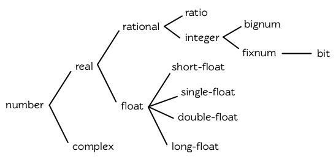
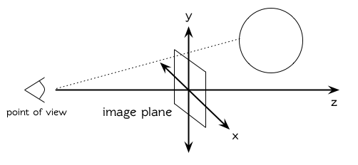

第九章：数字
============

处理数字是 Common Lisp 的强项之一。Common Lisp 有着丰富的数值类型，而
Common Lisp 操作数字的特性与其他语言比起来更受人喜爱。

9.1 类型 (Types)
----------------

Common Lisp
提供了四种不同类型的数字：整数、浮点数、比值与复数。本章所讲述的函数适用于所有类型的数字。有几个不能用在复数的函数会特别说明。

整数写成一串数字：如 `2001` 。浮点数是可以写成一串包含小数点的数字，如
`253.72` ，或是用科学表示法，如 `2.5372e2`
。比值是写成由整数组成的分数：如 `2/3` 。而复数 `a+bi` 写成 `#c(a b)`
，其中 `a` 与 `b` 是任两个类型相同的实数。

谓词 `integerp` 、 `floatp` 以及 `complexp` 针对相应的数字类型返回真。图
9.1 展示了数值类型的层级。

**图 9.1: 数值类型**

要决定计算过程会返回何种数字，以下是某些通用的经验法则：

1.  如果数值函数接受一个或多个浮点数作为参数，则返回值会是浮点数
    (或是由浮点数组成的复数)。所以 `(+ 1.0 2)` 求值为 `3.0` ，而
    `(+ #c(0 1.0) 2)` 求值为 `#c(2.0 1.0)` 。
2.  可约分的比值会被转换成最简分数。所以 `(/ 10 2)` 会返回 `5` 。
3.  若计算过程中复数的虚部变成 `0` 时，则复数会被转成实数 。所以
    `(+ #c(1 -1) #c(2 1))` 求值成 `3` 。

第二、第三个规则可以在读入参数时直接应用，所以：

    > (list (ratiop 2/2) (complexp #c(1 0)))
    (NIL NIL)

9.2 转换及取出 (Conversion and Extraction)
------------------------------------------

Lisp 提供四种不同类型的数字的转换及取出位数的函数。函数 `float`
将任何实数转换成浮点数:

    > (mapcar #'float '(1 2/3 .5))
    (1.0 0.6666667 0.5)

将数字转成整数未必需要转换，因为它可能牵涉到某些资讯的丧失。函数
`truncate` 返回任何实数的整数部分:

    > (truncate 1.3)
    1
    0.29999995

第二个返回值 `0.29999995` 是传入的参数减去第一个返回值。(会有 0.00000005
的误差是因为浮点数的计算本身就不精确。)

函数 `floor` 与 `ceiling` 以及 `round` 也从它们的参数中导出整数。使用
`floor` 返回小于等于其参数的最大整数，而 `ceiling`
返回大于或等于其参数的最小整数，我们可以将 `mirror?` (46 页，译注: 3.11
节)改成可以找出所有回文（palindromes）的版本:

    (defun palindrome? (x)
      (let ((mid (/ (length x) 2)))
        (equal (subseq x 0 (floor mid))
               (reverse (subseq x (ceiling mid))))))

和 `truncate` 一样， `floor` 与 `ceiling`
也返回传入参数与第一个返回值的差，作为第二个返回值。

    > (floor 1.5)
    1
    0.5

实际上，我们可以把 `truncate` 想成是这样定义的:

    (defun our-truncate (n)
        (if (> n 0)
            (floor n)
            (ceiling n)))

函数 `round` 返回最接近其参数的整数。当参数与两个整数的距离相等时，
Common Lisp 和很多程序语言一样，不会往上取（round
up）整数。而是取最近的偶数：

    > (mapcar #'round '(-2.5 -1.5 1.5 2.5))
    (-2 -2 2 2)

在某些数值应用中这是好事，因为舍入误差（rounding
error）通常会互相抵消。但要是用户期望你的程序将某些值取整数时，你必须自己提供这个功能。
[^1] 与其他的函数一样， `round`
返回传入参数与第一个返回值的差，作为第二个返回值。

函数 `mod` 仅返回 `floor` 返回的第二个返回值；而 `rem` 返回 `truncate`
返回的第二个返回值。我们在 94 页（译注： 5.7 节）曾使用 `mod`
来决定一个数是否可被另一个整除，以及 127 页（译注： 7.4
节）用来找出环状缓冲区（ring buffer）中，元素实际的位置。

关于实数，函数 `signum` 返回 `1` 、 `0` 或 `-1`
，取决于它的参数是正数、零或负数。函数 `abs` 返回其参数的绝对值。因此
`(* (abs x) (signum x))` 等于 `x` 。

    > (mapcar #'signum '(-2 -0.0 0.0 0 .5 3))
    (-1 -0.0 0.0 0 1.0 1)

在某些应用里， `-0.0` 可能自成一格（in its own
right），如上所示。实际上功能上几乎没有差别，因为数值 `-0.0` 与 `0.0`
有着一样的行为。

比值与复数概念上是两部分的结构。(译注：像 **Cons** 这样的两部分结构)
函数 `numerator` 与 `denominator`
返回比值或整数的分子与分母。（如果数字是整数，前者返回该数，而后者返回
`1` 。）函数 `realpart` 与 `imgpart`
返回任何数字的实数与虚数部分。（如果数字不是复数，前者返回该数字，后者返回
`0` 。）

函数 `random` 接受一个整数或浮点数。这样形式的表达式 `(random n)`
，会返回一个大于等于 `0` 并小于 `n` 的数字，并有着与 `n` 相同的类型。

9.3 比较 (Comparison)
---------------------

谓词 `=` 比较其参数，当数值上相等时 ── 即两者的差为零时，返回真。

    > (= 1 1.0)
    T
    > (eql 1 1.0)
    NIL

`=` 比起 `eql` 来得宽松，但参数的类型需一致。

用来比较数字的谓词为 `<` （小于）、 `<=` （小于等于）、 `=` （等于）、
`>=` （大于等于）、 `>` (大于) 以及 `/=`
（不相等）。以上所有皆接受一个或多个参数。只有一个参数时，它们全返回真。

    (<= w x y z)

等同于二元操作符的结合（conjunction），应用至每一对参数上:

    (and (<= w x) (<= x y) (<= y z))

由于 `/=` 若它的两个参数不等于时会返回真，表达式

    (/= w x y z)

等同于

    (and (/= w x) (/= w y) (/= w z)
         (/= x y) (/= y z) (/= y z))

特殊的谓词 `zerop` 、 `plusp` 与 `minusp` 接受一个参数，分别于参数 `=`
、 `>` 、 `<` 零时，返回真。虽然 `-0.0`
（如果实现有使用它）前面有个负号，但它 `=` 零，

    > (list (minusp -0.0) (zerop -0.0))
    (NIL T)

因此对 `-0.0` 使用 `zerop` ，而不是 `minusp` 。

谓词 `oddp` 与 `evenp`
只能用在整数。前者只对奇数返回真，后者只对偶数返回真。

本节定义的谓词中，只有 `=` 、 `/=` 与 `zerop` 可以用在复数。

函数 `max` 与 `min`
分别返回其参数的最大值与最小值。两者至少需要给一个参数:

    > (list (max 1 2 3 4 5) (min 1 2 3 4 5))
    (5 1)

如果参数含有浮点数的话，结果的类型取决于各家实现。

9.4 算术 (Arithematic)
----------------------

用来做加减的函数是 `+` 与 `-`
。两者皆接受任何数量的参数，包括没有参数，在没有参数的情况下返回 `0`
。（译注: `-`
在没有参数的情况下会报错，至少要一个参数）一个这样形式的表达式 `(- n)`
返回 `-n` 。一个这样形式的表达式

    (- x y z)

等同于

    (- (- x y) z)

有两个函数 `1+` 与 `1-` ，分别将参数加 `1` 与减 `1` 后返回。 `1-`
有一点误导，因为 `(1- x)` 返回 `x-1` 而不是 `1-x` 。

宏 `incf` 及 `decf` 分别递增与递减数字。这样形式的表达式 `(incf x n)`
类似于 `(setf x (+ x n))` 的效果，而 `(decf x n)` 类似于
`(setf x (- x n))`
的效果。这两个形式里，第二个参数皆是选择性给入的，缺省值为 `1` 。

用来做乘法的函数是 `*` 。接受任何数量的参数。没有参数时返回 `1`
。否则返回参数的乘积。

除法函数 `/` 至少要给一个参数。这样形式的调用 `(/ n)` 等同于 `(/ 1 n)`
，

    > (/ 3)
    1/3

而这样形式的调用

    (/ x y z)

等同于

    (/ (/ x y) z)

注意 `-` 与 `/` 两者在这方面的相似性。

当给定两个整数时， `/` 若第一个不是第二个的倍数时，会返回一个比值:

    > (/ 365 12)
    365/12

举例来说，如果你试着找出平均每一个月有多长，可能会有解释器在逗你玩的感觉。在这个情况下，你需要的是，对比值调用
`float` ，而不是对两个整数做 `/` 。

    > (float 365/12)
    30.416666

9.5 指数 (Exponentiation)
-------------------------

要找到 $x^n$ 调用 `(expt x n)` ，

    > (expt 2 5)
    32

而要找到 $log_nx$ 调用 `(log x n)` :

    > (log 32 2)
    5.0

通常返回一个浮点数。

要找到 $e^x$ 有一个特别的函数 `exp` ，

    > (exp 2)
    7.389056

而要找到自然对数，你可以使用 `log` 就好，因为第二个参数缺省为 `e` :

    > (log 7.389056)
    2.0

要找到立方根，你可以调用 `expt` 用一个比值作为第二个参数，

    > (expt 27 1/3)
    3.0

但要找到平方根，函数 `sqrt` 会比较快:

    > (sqrt 4)
    2.0

9.6 三角函数 (Trigometric Functions)
------------------------------------

常量 `pi` 是 `π` 的浮点表示法。它的精度取决于各家实现。函数 `sin` 、
`cos` 及 `tan` 分别可以找到正弦、余弦及正交函数，其中角度以径度表示：

    > (let ((x (/ pi 4)))
        (list (sin x) (cos x) (tan x)))
    (0.7071067811865475d0 0.7071067811865476d0 1.0d0)
    ;;; 译注: CCL 1.8  SBCL 1.0.55 下的结果是
    ;;; (0.7071067811865475D0 0.7071067811865476D0 0.9999999999999999D0)

这些函数都接受负数及复数参数。

函数 `asin` 、 `acos` 及 `atan` 实现了正弦、余弦及正交的反函数。参数介于
`-1` 与 `1` 之间（包含）时， `asin` 与 `acos` 返回实数。

双曲正弦、双曲余弦及双曲正交分别由 `sinh` 、 `cosh` 及 `tanh`
实现。它们的反函数同样为 `asinh` 、 `acosh` 以及 `atanh` 。

9.7 表示法 (Representations)
----------------------------

Common Lisp
没有限制整数的大小。可以塞进一个字（word）内存的小整数称为定长数(fixnums)。在计算过程中，整数无法塞入一个字时，Lisp
切换至使用多个字的表示法（一个大数
「bignum」）。所以整数的大小限制取决于实体内存，而不是语言。

常量 `most-positive-fixnum` 与 `most-negative-fixnum`
表示一个实现不使用大数所可表示的最大与最小的数字大小。在很多实现里，它们为：

    > (values most-positive-fixnum most-negative-fixnum)
    536870911
    -536870912
    ;;; 译注: CCL 1.8 的结果为
    1152921504606846975
    -1152921504606846976
    ;;; SBCL 1.0.55 的结果为
    4611686018427387903
    -4611686018427387904

谓词 `typep` 接受一个参数及一个类型名称，并返回指定类型的参数。所以，

    > (typep 1 'fixnum)
    T
    > (type (1+ most-positive-fixnum) 'bignum)
    T

浮点数的数值限制是取决于各家实现的。 Common Lisp
提供了至多四种类型的浮点数：短浮点 `short-float` 、 单浮点
`single-float` 、双浮点 `double-float` 以及长浮点 `long-float` 。Common
Lisp 的实现是不需要用不同的格式来表示这四种类型（很少有实现这么干）。

一般来说，短浮点应可塞入一个字，单浮点与双浮点提供普遍的单精度与双精度浮点数的概念，而长浮点，如果想要的话，可以是很大的数。但实现可以不对这四种类型做区别，也是完全没有问题的。

你可以指定你想要何种格式的浮点数，当数字是用科学表示法时，可以通过将 `e`
替换为 `s` `f` `d` `l`
来得到不同的浮点数。（你也可以使用大写，这对长浮点来说是个好主意，因为
`l` 看起来太像 `1` 了。）所以要表示最大的 `1.0` 你可以写 `1L0` 。

（译注: `s` 为短浮点、 `f` 为单浮点、 `d` 为双浮点、 `l` 为长浮点。）

在给定的实现里，用十六个全局常量标明了每个格式的限制。它们的名字是这种形式:
`m-s-f` ，其中 `m` 是 `most` 或 `least` ， `s` 是 `positive` 或
`negative` ，而 `f` 是四种浮点数之一。
[λ](http://acl.readthedocs.org/en/latest/zhCN/notes-cn.html#notes-150)

浮点数下溢（underflow）与溢出（overflow），都会被 Common Lisp 视为错误 :

    > (* most-positive-long-float 10)
    Error: floating-point-overflow

9.8 范例：追踪光线 (Example: Ray-Tracing)
-----------------------------------------

作为一个数值应用的范例，本节示范了如何撰写一个光线追踪器
(ray-tracer)。光线追踪是一个高级的 (deluxe)渲染算法:
它产生出逼真的图像，但需要花点时间。

要产生一个 3D 的图像，我们至少需要定义四件事: 一个观测点
(eye)、一个或多个光源、一个由一个或多个平面所组成的模拟世界 (simulated
world)，以及一个作为通往这个世界的窗户的平面 (图像平面「image
plane」)。我们产生出的是模拟世界投影在图像平面区域的图像。

光线追踪独特的地方在于，我们如何找到这个投影:
我们一个一个像素地沿着图像平面走，追踪回到模拟世界里的光线。这个方法带来三个主要的优势:
它让我们容易得到现实世界的光学效应 (optical effect)，如透明度
(transparency)、反射光 (reflected light)以及产生阴影 (cast
shadows)；它让我们可以直接用任何我们想要的几何的物体，来定义出模拟的世界，而不需要用多边形
(polygons)来建构它们；以及它很简单实现。

    (defun sq (x) (* x x))

    (defun mag (x y z)
      (sqrt (+ (sq x) (sq y) (sq z))))

    (defun unit-vector (x y z)
      (let ((d (mag x y z)))
        (values (/ x d) (/ y d) (/ z d))))

    (defstruct (point (:conc-name nil))
      x y z)

    (defun distance (p1 p2)
      (mag (- (x p1) (x p2))
           (- (y p1) (y p2))
           (- (z p1) (z p2))))

    (defun minroot (a b c)
      (if (zerop a)
          (/ (- c) b)
          (let ((disc (- (sq b) (* 4 a c))))
            (unless (minusp disc)
              (let ((discrt (sqrt disc)))
                (min (/ (+ (- b) discrt) (* 2 a))
                     (/ (- (- b) discrt) (* 2 a))))))))

**图 9.2 实用数学函数**

图 9.2 包含了我们在光线追踪器里会需要用到的一些实用数学函数。第一个 `sq`
，返回其参数的平方。下一个 `mag` ，返回一个给定 `x` `y` `z`
所组成向量的大小 (magnitude)。这个函数被接下来两个函数用到。我们在
`unit-vector`
用到了，此函数返回三个数值，来表示与单位向量有着同样方向的向量，其中向量是由
`x` `y` `z` 所组成的:

    > (multiple-value-call #'mag (unit-vector 23 12 47))
    1.0

我们在 `distance` 也用到了 `mag` ，它返回三维空间中，两点的距离。（定义
`point` 结构来有一个 `nil` 的 `conc-name`
意味着栏位存取的函数会有跟栏位一样的名字: 举例来说， `x` 而不是
`point-x` 。)

最后 `minroot` 接受三个实数， `a` , `b` 与 `c` ，并返回满足等式
$ax^2+bx+c=0$ 的最小实数 `x` 。当 `a` 不为 $0$
时，这个等式的根由下面这个熟悉的式子给出:

$$x = \dfrac{-b \pm \sqrt{b^2 - 4ac}}{2a}$$

图 9.3 包含了定义一个最小光线追踪器的代码。
它产生通过单一光源照射的黑白图像，与观测点 (eye)处于同个位置。
(结果看起来像是闪光摄影术 (flash photography)拍出来的)

`surface` 结构用来表示模拟世界中的物体。更精确的说，它会被 `included`
至定义具体类型物体的结构里，像是球体 (spheres)。 `surface`
结构本身只包含一个栏位: 一个 `color` 范围从 0 (黑色) 至 1 (白色)。

    (defstruct surface color)

    (defparameter *world* nil)
    (defconstant eye (make-point :x 0 :y 0 :z 200))

    (defun tracer (pathname &optional (res 1))
      (with-open-file (p pathname :direction :output)
        (format p "P2 ~A ~A 255" (* res 100) (* res 100))
        (let ((inc (/ res)))
          (do ((y -50 (+ y inc)))
              ((< (- 50 y) inc))
            (do ((x -50 (+ x inc)))
                ((< (- 50 x) inc))
              (print (color-at x y) p))))))

    (defun color-at (x y)
      (multiple-value-bind (xr yr zr)
                           (unit-vector (- x (x eye))
                                        (- y (y eye))
                                        (- 0 (z eye)))
        (round (* (sendray eye xr yr zr) 255))))

    (defun sendray (pt xr yr zr)
      (multiple-value-bind (s int) (first-hit pt xr yr zr)
        (if s
            (* (lambert s int xr yr zr) (surface-color s))
            0)))

    (defun first-hit (pt xr yr zr)
      (let (surface hit dist)
        (dolist (s *world*)
          (let ((h (intersect s pt xr yr zr)))
            (when h
              (let ((d (distance h pt)))
                (when (or (null dist) (< d dist))
                  (setf surface s hit h dist d))))))
        (values surface hit)))

    (defun lambert (s int xr yr zr)
      (multiple-value-bind (xn yn zn) (normal s int)
        (max 0 (+ (* xr xn) (* yr yn) (* zr zn)))))

**图 9.3 光线追踪。**

图像平面会是由 x 轴与 y 轴所定义的平面。观测者 (eye) 会在 z 轴，距离原点
200 个单位。所以要在图像平面可以被看到，插入至 `*worlds*` 的表面
(一开始为 `nil`)会有着负的 z 座标。图 9.4
说明了一个光线穿过图像平面上的一点，并击中一个球体。

**图 9.4: 追踪光线。**

函数 `tracer`
接受一个路径名称，并写入一张图片至对应的文件。图片文件会用一种简单的
ASCII 称作 PGM 的格式写入。默认情况下，图像会是 100x100 。我们 PGM
文件的标头 (headers) 会由标签 `P2` 组成，伴随着指定图片宽度
(breadth)与高度 (height)的整数，初始为 100，单位为
pixel，以及可能的最大值 (255)。文件剩余的部份会由 10000 个介于 0 (黑)与
1 (白)整数组成，代表着 100 条 100 像素的水平线。

图片的解析度可以通过给入明确的 `res` 来调整。举例来说，如果 `res` 是 `2`
，则同样的图像会被渲染成 200x200 。

图片是一个在图像平面 100x100
的正方形。每一个像素代表着穿过图像平面抵达观测点的光的数量。要找到每个像素光的数量，
`tracer` 调用 `color-at` 。这个函数找到从观测点至该点的向量，并调用
`sendray` 来追踪这个向量回到模拟世界的轨迹； `sandray`
会返回一个数值介于 0 与 1 之间的亮度 (intensity)，之后会缩放成一个 0 至
255 的整数来显示。

要决定一个光线的亮度， `sendray`
需要找到光是从哪个物体所反射的。要办到这件事，我们调用 `first-hit`
，此函数研究在 `*world*`
里的所有平面，并返回光线最先抵达的平面（如果有的话）。如果光没有击中任何东西，
`sendray` 仅返回背景颜色，按惯例是 `0`
(黑色)。如果光线有击中某物的话，我们需要找出在光击中时，有多少数量的光照在该平面。

[朗伯定律](http://zh.wikipedia.org/zh-tw/%E6%AF%94%E5%B0%94%EF%BC%8D%E6%9C%97%E4%BC%AF%E5%AE%9A%E5%BE%8B)
告诉我们，由平面上一点所反射的光的强度，正比于该点的单位法向量 (unit
normal vector) *N*
(这里是与平面垂直且长度为一的向量)与该点至光源的单位向量 *L* 的点积
(dot-product):

$$i = N·L$$

如果光刚好照到这点， *N* 与 *L* 会重合 (coincident)，则点积会是最大值，
`1` 。如果将在这时候将平面朝光转 90 度，则 *N* 与 *L*
会垂直，则两者点积会是 `0` 。如果光在平面后面，则点积会是负数。

在我们的程序里，我们假设光源在观测点 (eye)，所以 `lambert`
使用了这个规则来找到平面上某点的亮度
(illumination)，返回我们追踪的光的单位向量与法向量的点积。

在 `sendray` 这个值会乘上平面的颜色
(即便是有好的照明，一个暗的平面还是暗的)来决定该点之后总体亮度。

为了简单起见，我们在模拟世界里会只有一种物体，球体。图 9.5
包含了与球体有关的代码。球体结构包含了 `surface`
，所以一个球体会有一种颜色以及 `center` 和 `radius` 。调用 `defsphere`
添加一个新球体至世界里。

    (defstruct (sphere (:include surface))
      radius center)

    (defun defsphere (x y z r c)
      (let ((s (make-sphere
                 :radius r
                 :center (make-point :x x :y y :z z)
                 :color  c)))
        (push s *world*)
        s))

    (defun intersect (s pt xr yr zr)
      (funcall (typecase s (sphere #'sphere-intersect))
               s pt xr yr zr))

    (defun sphere-intersect (s pt xr yr zr)
      (let* ((c (sphere-center s))
             (n (minroot (+ (sq xr) (sq yr) (sq zr))
                         (* 2 (+ (* (- (x pt) (x c)) xr)
                                 (* (- (y pt) (y c)) yr)
                                 (* (- (z pt) (z c)) zr)))
                         (+ (sq (- (x pt) (x c)))
                            (sq (- (y pt) (y c)))
                            (sq (- (z pt) (z c)))
                            (- (sq (sphere-radius s)))))))
        (if n
            (make-point :x  (+ (x pt) (* n xr))
                        :y  (+ (y pt) (* n yr))
                        :z  (+ (z pt) (* n zr))))))

    (defun normal (s pt)
      (funcall (typecase s (sphere #'sphere-normal))
               s pt))

    (defun sphere-normal (s pt)
      (let ((c (sphere-center s)))
        (unit-vector (- (x c) (x pt))
                     (- (y c) (y pt))
                     (- (z c) (z pt)))))

**图 9.5 球体。**

函数 `intersect` 判断与何种平面有关，并调用对应的函数。在此时只有一种，
`sphere-intersect` ，但 `intersect` 是写成可以容易扩展处理别种物体。

我们要怎么找到一束光与一个球体的交点 (intersection)呢？光线是表示成点
$p =〈x_0,y_0,x_0〉$ 以及单位向量 $v =〈x_r,y_r,x_r〉$
。每个在光上的点可以表示为 $p+nv$ ，对于某个 *n* ── 即
$〈x_0+nx_r,y_0+ny_r,z_0+nz_r〉$ 。光击中球体的点的距离至中心
$〈x_c,y_c,z_c〉$ 会等于球体的半径 *r*
。所以在下列这个交点的方程序会成立:

$$r = \sqrt{ (x_0 + nx_r - x_c)^2 + (y_0 + ny_r - y_c)^2 + (z_0 + nz_r - z_c)^2 }$$

这会给出

$$an^2 + bn + c = 0$$

其中

$$a = x_r^2 + y_r^2 + z_r^2\\b = 2((x_0-x_c)x_r + (y_0-y_c)y_r + (z_0-z_c)z_r)\\c = (x_0-x_c)^2 + (y_0-y_c)^2 + (z_0-z_c)^2 - r^2$$

要找到交点我们只需要找到这个二次方程序的根。它可能是零、一个或两个实数根。没有根代表光没有击中球体；一个根代表光与球体交于一点
(擦过 「grazing hit」)；两个根代表光与球体交于两点
(一点交于进入时、一点交于离开时)。在最后一个情况里，我们想要两个根之中较小的那个；
*n* 与光离开观测点的距离成正比，所以先击中的会是较小的 *n*
。所以我们调用 `minroot` 。如果有一个根， `sphere-intersect`
返回代表该点的 $〈x_0+nx_r,y_0+ny_r,z_0+nz_r〉$ 。

图 9.5 的另外两个函数， `normal` 与 `sphere-normal` 类比于 `intersect`
与 `sphere-intersect` 。要找到垂直于球体很简单 ──
不过是从该点至球体中心的向量而已。

图 9.6 示范了我们如何产生图片； `ray-test` 定义了 38
个球体（不全都看的见）然后产生一张图片，叫做 "sphere.pgm" 。

(译注：PGM 可移植灰度图格式，更多信息参见
[wiki](http://en.wikipedia.org/wiki/Portable_graymap) )

    (defun ray-test (&optional (res 1))
      (setf *world* nil)
      (defsphere 0 -300 -1200 200 .8)
      (defsphere -80 -150 -1200 200 .7)
      (defsphere 70 -100 -1200 200 .9)
      (do ((x -2 (1+ x)))
          ((> x 2))
        (do ((z 2 (1+ z)))
            ((> z 7))
          (defsphere (* x 200) 300 (* z -400) 40 .75)))
      (tracer (make-pathname :name "spheres.pgm") res))

**图 9.6 使用光线追踪器**

图 9.7 是产生出来的图片，其中 `res` 参数为 10。

**图 9.7: 追踪光线的图**

一个实际的光线追踪器可以产生更复杂的图片，因为它会考虑更多，我们只考虑了单一光源至平面某一点。可能会有多个光源，每一个有不同的强度。它们通常不会在观测点，在这个情况程序需要检查至光源的向量是否与其他平面相交，这会在第一个相交的平面上产生阴影。将光源放置于观测点让我们不需要考虑这麽复杂的情况，因为我们看不见在阴影中的任何点。

一个实际的光线追踪器不仅追踪光第一个击中的平面，也会加入其它平面的反射光。一个实际的光线追踪器会是有颜色的，并可以模型化出透明或是闪耀的平面。但基本的算法会与图
9.3 所演示的差不多，而许多改进只需要递回的使用同样的成分。

一个实际的光线追踪器可以是高度优化的。这里给出的程序为了精简写成，甚至没有如
Lisp
程序员会最佳化的那样，就仅是一个光线追踪器而已。仅加入类型与行内宣告
(13.3 节)就可以让它变得两倍以上快。

Chapter 9 总结 (Summary)
------------------------

1.  Common Lisp 提供整数 (integers)、比值 (ratios)、浮点数
    (floating-point numbers)以及复数 (complex numbers)。
2.  数字可以被约分或转换 (converted)，而它们的位数
    (components)可以被取出。
3.  用来比较数字的谓词可以接受任意数量的参数，以及比较下一数对
    (successive pairs) ── /= 函数除外，它是用来比较所有的数对 (pairs)。
4.  Common Lisp
    几乎提供你在低阶科学计算机可以看到的数值函数。同样的函数普遍可应用在多种类型的数字上。
5.  Fixnum 是小至可以塞入一个字
    (word)的整数。它们在必要时会悄悄但花费昂贵地转成大数
    (bignum)。Common Lisp
    提供最多四种浮点数。每一个浮点表示法的限制是实现相关的
    (implementation-dependent)常量。
6.  一个光线追踪器
    (ray-tracer)通过追踪光线来产生图像，使得每一像素回到模拟的世界。

Chapter 9 练习 (Exercises)
--------------------------

1.  定义一个函数，接受一个实数列表，若且唯若 (iff)它们是非递减
    (nondecreasing)顺序时返回真。
2.  定义一个函数，接受一个整数 `cents` 并返回四个值，将数字用 `25-` ,
    `10-` , `5-` , `1-` 来显示，使用最少数量的硬币。(译注: `25-` 是 25
    美分，以此类推)
3.  一个遥远的星球住着两种生物， wigglies 与 wobblies 。 Wigglies 与
    wobblies
    唱歌一样厉害。每年都有一个比赛来选出十大最佳歌手。下面是过去十年的结果:

  YEAR        1    2    3    4    5    6    7    8    9    10
  ----------- ---- ---- ---- ---- ---- ---- ---- ---- ---- -----
  WIGGLIES    6    5    6    4    5    5    4    5    6    5
  WOBBLIES    4    5    4    6    5    5    6    5    4    5

写一个程序来模拟这样的比赛。你的结果实际上有建议委员会每年选出 10
个最佳歌手吗？

4.  定义一个函数，接受 8
    个表示二维空间中两个线段端点的实数，若线段没有相交，则返回假，或返回两个值表示相交点的
    `x` 座标与 `y` 座标。
5.  假设 `f` 是一个接受一个 (实数) 参数的函数，而 `min` 与 `max`
    是有着不同正负号的非零实数，使得 `f` 对于参数 `i` 有一个根
    (返回零)并满足 `min < i < max` 。定义一个函数，接受四个参数， `f` ,
    `min` , `max` 以及 `epsilon` ，并返回一个 `i` 的近似值，准确至正负
    `epsilon` 之内。
6.  *Honer's method* 是一个有效率求出多项式的技巧。要找到
    $ax^3+bx^2+cx+d$ 你对 `x(x(ax+b)+c)+d`
    求值。定义一个函数，接受一个或多个参数 ── x 的值伴随着 *n*
    个实数，用来表示 `(n-1)` 次方的多项式的系数 ── 并用 *Honer's method*
    计算出多项式的值。

译注: [Honer's method on
wiki](http://en.wikipedia.org/wiki/Horner's_method)

7.  你的 Common Lisp 实现使用了几个位元来表示定长数？
8.  你的 Common Lisp 实现提供几种不同的浮点数？

**脚注**

[^1]: 当 `format` 取整显示时，它不保证会取成偶数或奇数。见 125 页 (译注:
    7.4 节)。
